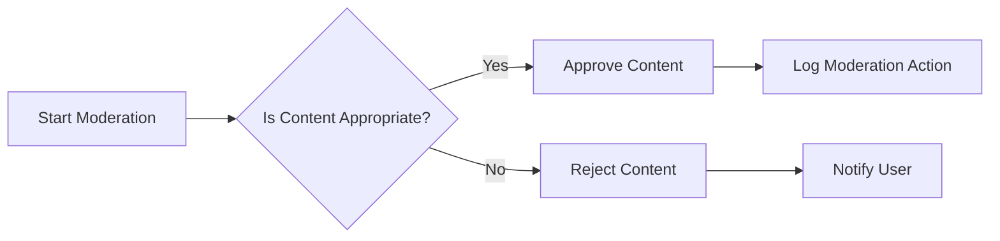

## Moderation Requirements

### Moderator Responsibilities

THE moderator SHALL have the following responsibilities:
1. Managing and reviewing user-generated content
2. Ensuring compliance with community guidelines
3. Handling user reports and complaints
4. Taking appropriate actions against violating content or users

### Content Management

WHEN a user submits content, THE system SHALL:
1. Notify moderators of new content for review
2. Allow moderators to review, approve, or reject content
3. Provide tools for moderators to categorize content
4. Maintain a log of moderation actions for auditing

### User Management

THE system SHALL provide moderators with the ability to:
1. View user profiles and posting history
2. Take actions against users violating guidelines (e.g., warnings, bans)
3. Monitor user behavior and flag suspicious activity
4. Communicate with users regarding moderation decisions

### Integration with Other Features

THE moderation system SHALL integrate with:
1. User Roles (02-user-roles.md) for role-based access control
2. Discussion Management (04-discussion-management.md) for managing discussions
3. Notification System (07-notification-system.md) for alerting moderators

