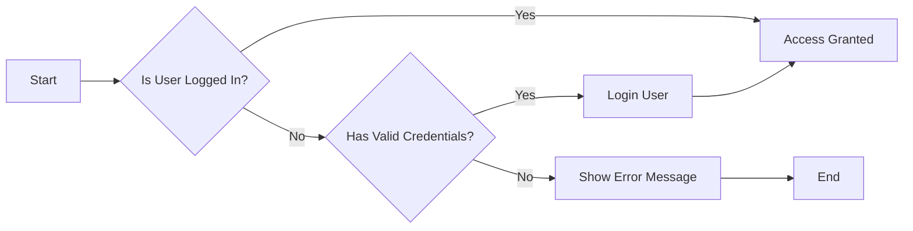

## Authentication Requirements

### Overview
The discussion board system requires a robust authentication mechanism to ensure secure access for users. This document outlines the key requirements for the authentication process, including login, registration, and session management.

### Login Process Requirements
1. Users shall be able to log in using their registered email address and password.
2. The system shall validate the entered credentials against stored user data.
3. Upon successful authentication, the system shall create a new user session.
4. The system shall implement rate limiting on login attempts to prevent brute-force attacks.

### Registration Process Requirements
1. Users shall be able to register by providing a valid email address and password.
2. The system shall validate the email address format and ensure it is not already in use.
3. The system shall enforce password strength requirements (e.g., minimum length, special characters).
4. Upon registration, the system shall send a verification email to the provided email address.
5. The user's account shall remain inactive until the email address is verified.

### Session Management Requirements
1. The system shall maintain user sessions securely.
2. Sessions shall have a reasonable expiration time (e.g., 30 minutes of inactivity).
3. The system shall allow for session renewal upon user activity.
4. Session tokens shall be handled securely to prevent unauthorized access.

### EARS Format Requirements
The following requirements are expressed in EARS (Easy Approach to Requirements Syntax) format:

1. WHEN a user submits valid login credentials, THE system SHALL authenticate the user and create a new session.
2. IF the login credentials are invalid, THEN THE system SHALL return an appropriate error message.
3. WHEN a user registers with a valid email and password, THE system SHALL send a verification email.
4. WHILE the user's email is not verified, THE system SHALL restrict access to certain features.
5. WHERE the user's session is active, THE system SHALL maintain user authentication state.

### Authentication Flow Diagram
The following Mermaid diagram illustrates the authentication flow:

### Conclusion
This document provides comprehensive requirements for implementing authentication in the discussion board system. By following these requirements, the system will ensure secure and user-friendly access control for all users.