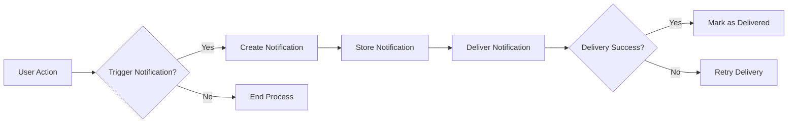

## Notification System Documentation

## Overview
The notification system is designed to keep users informed about relevant activities on the discussion board. It provides real-time alerts for various events while allowing users to customize their notification preferences.

## Functional Requirements

### Notification Types
1. **Discussion Updates**: Notifications when someone replies to a discussion the user is following
2. **Mention Notifications**: Alerts when a user is mentioned in a post or comment
3. **Moderation Notifications**: Notifications for moderators when content is reported or requires review
4. **System Notifications**: Important system updates, maintenance alerts, or policy changes

### User Preferences
THE system SHALL allow users to customize notification preferences.
WHEN a user changes their notification preferences, THE system SHALL update their settings immediately.

### Notification Triggers
1. WHEN a user is mentioned in a post or comment, THE system SHALL send a notification.
2. WHEN there's activity in discussions a user is following, THE system SHALL notify the user.
3. WHEN content a user has posted is commented on or liked, THE system SHALL notify the user.
4. WHEN moderation action is required, THE system SHALL notify moderators.
5. WHEN system-wide announcements or updates occur, THE system SHALL notify relevant users.

## Performance Requirements
1. THE system SHALL deliver notifications in real-time.
2. THE system SHALL handle high volumes of notification triggers without performance degradation.
3. THE system SHALL store notifications for a reasonable period to maintain user history.

## Security Requirements
1. THE system SHALL only send notifications to authorized users.
2. THE system SHALL prevent unauthorized access to notification data.
3. THE system SHALL store notifications securely with proper access controls.

## User Interface Requirements
1. Users can access their notification history through their profile.
2. Users can mark notifications as read.
3. The system SHALL display unread notification count in real-time.

## Error Handling
1. IF notification delivery fails, THEN THE system SHALL retry delivery.
2. IF repeated delivery failures occur, THEN THE system SHALL log the error and notify administrators.

## Diagrams

This document provides comprehensive requirements for the notification system, including functional, performance, and security requirements. It serves as a guide for backend developers to implement a robust and user-friendly notification system.