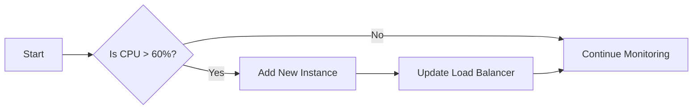

# Performance and Scaling Requirements for Discussion Board

## Overview
The discussion board application is expected to handle significant traffic and growth. This document outlines the performance and scaling requirements to ensure the system remains responsive under varying loads.

## Expected Traffic and Load
- Average traffic: 1,000 unique visitors per day
- Peak traffic: Up to 5,000 unique visitors during special events
- Growth projection: 20% monthly traffic increase
- Average posts per day: 500, with potential spikes during events

## Performance Metrics
- Response time: All pages should load within 2 seconds under normal conditions
- Throughput: The system should handle at least 100 concurrent users without degradation
- Resource utilization: CPU and memory should not exceed 70% during peak loads

## Scaling Strategies
- Horizontal scaling: The system should be designed to scale horizontally by adding more instances as needed
- Auto-scaling: Configure to add instances when CPU utilization exceeds 60% for 5 minutes
- Load balancing: Use round-robin load balancing to distribute traffic across instances

## Infrastructure Requirements
- Server specifications: Minimum 2 CPU cores, 4GB RAM per instance
- Database: Use a managed database service with read replicas for improved performance
- Caching: Implement Redis caching for frequently accessed data like article metadata and user sessions

## Monitoring and Alerting
- Monitoring tools: Prometheus and Grafana for performance metrics
- Alert thresholds: Configure alerts for CPU utilization above 80%, response times over 2 seconds, and error rates above 1%
- Logging: Centralized logging with ELK Stack for system and application logs

## EARS Format Requirements
### Ubiquitous Requirements
THE discussion board system SHALL be designed for horizontal scaling.
THE system SHALL use load balancing to distribute traffic.

### Event-driven Requirements
WHEN CPU utilization exceeds 60% for 5 minutes, THEN THE system SHALL automatically add new instances.
WHEN response time exceeds 2 seconds, THEN THE system SHALL trigger an alert.

### State-driven Requirements
WHILE under peak load, THE system SHALL maintain response times below 2 seconds.

### Unwanted Behavior Requirements
IF resource utilization exceeds 80%, THEN THE system SHALL trigger a critical alert.

## Mermaid Diagram for Scaling Flow

This document provides comprehensive performance and scaling requirements for the discussion board application, ensuring it can handle expected traffic and growth while maintaining performance.