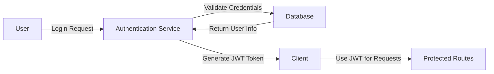

# Security Considerations for Discussion Board

## Overview
The discussion board application requires robust security measures to protect user data and prevent common web application vulnerabilities. This document outlines key security considerations and best practices for implementation.

## Security Threats and Mitigations

### 1. Authentication and Authorization
WHEN a user attempts to log in, THE system SHALL validate credentials against stored information.
IF credentials are valid, THEN THE system SHALL generate a JWT token containing user ID, role, and permissions.
THE JWT token SHALL be required for all protected routes.

### 2. Cross-Site Scripting (XSS)
THE system SHALL implement strict Content Security Policy (CSP) to prevent XSS attacks.
ALL user-generated content SHALL be sanitized before display.

### 3. SQL Injection
THE system SHALL use parameterized queries with Prisma ORM to prevent SQL injection.

### 4. Cross-Site Request Forgery (CSRF)
THE system SHALL implement CSRF tokens for all state-changing requests.

## Data Protection Measures

### 1. User Data Protection
THE system SHALL encrypt sensitive user data both at rest and in transit.

### 2. Attachment Security
THE system SHALL validate and sanitize all file uploads.
Attachments SHALL be stored outside the web root directory.

### 3. Logging and Monitoring
THE system SHALL implement comprehensive logging of security-related events.

## Authentication Requirements

### Core Authentication Functions
1. Users can register with email and password
2. Users can log in to access their account
3. Users can log out to end their session
4. System maintains user sessions securely
5. Users can verify their email address
6. Users can reset forgotten passwords
7. Users can change their password
8. Users can revoke access from all devices

## Authorization Rules
1. Guest users can view public content
2. Registered users can create articles and comments
3. Moderators can manage all content
4. Administrators have full system access

## Implementation Guidelines
1. Use TypeScript with strict type checking
2. Implement Prisma ORM for database interactions
3. Follow OWASP security guidelines
4. Implement proper error handling without revealing sensitive information

## Security Best Practices
1. Regular security training for development team
2. Continuous monitoring of security advisories
3. Automated security testing in CI/CD pipeline
4. Regular backup and disaster recovery procedures

