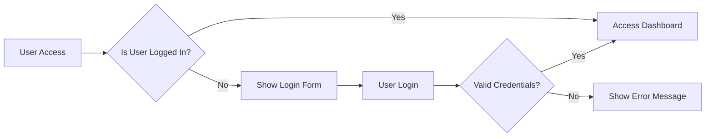

# Service Overview

The discussion board is designed to provide a platform for users to engage in economic and political discussions. It aims to facilitate the exchange of ideas, foster debate, and promote understanding among participants with diverse viewpoints.

## Service Purpose
The primary purpose of this discussion board is to create a dedicated space for structured economic and political discussions. The system will allow users to create accounts, post discussions, comment on posts, and engage with others through various features.

### Problem Statement
Existing platforms often lack the necessary features to support meaningful discussions, leading to fragmented conversations and limited engagement. This discussion board aims to address these issues by providing a robust and user-friendly platform.

### Target Audience
The primary users of this discussion board are individuals interested in economic and political discourse. This includes:

- **Guest Users**: Visitors who can view public discussions but are not logged in.
- **Registered Users**: Members who can create posts, comment, and engage in discussions. They have personal profiles and posting history.
- **Moderators**: Trusted users responsible for managing content, ensuring adherence to community guidelines, and maintaining order.
- **Administrators**: System administrators with full control over the platform, including user management and configuration settings.

## Core Features

1. **User Registration and Profiles**: Users can create accounts, manage their profiles, and track their activity.
2. **Discussion Management**: Users can create new discussions, post comments, and engage with others.
3. **Moderation Tools**: Moderators have access to tools for managing content, including post approval and user management.
4. **Search and Discovery**: Users can search for content and discover new discussions through various means.
5. **Notification System**: Users receive notifications about relevant activity, such as replies to their posts.

### EARS Requirements

- WHEN a user attempts to create a new discussion, THE system SHALL validate the input to ensure it meets content guidelines.
- THE system SHALL display discussions in a threaded format to facilitate easy reading and navigation.
- WHILE a user is logged in, THE system SHALL maintain their session securely.
- IF a user attempts to post inappropriate content, THEN THE system SHALL prevent the post from being published and notify the user.

### Mermaid Diagram

This document provides a comprehensive overview of the discussion board service, including its purpose, target audience, and core features. It serves as a foundation for understanding the requirements and functionalities of the system.