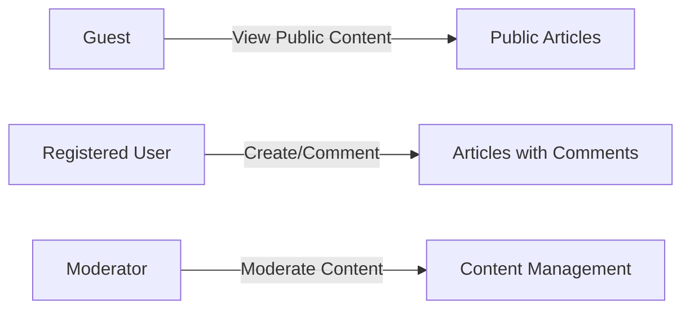

# Discussion Board Requirements Analysis Report

## 1. Service Overview
The discussion board service is designed to provide a platform for users to engage in economic and political discussions. The primary goal is to create a user-friendly and feature-rich environment that fosters meaningful interactions among its users.

## 2. User Actors and Authentication Requirements
The system will have three primary user actors: Guest, RegisteredUser, and Moderator. The authentication mechanism will be based on JWT (JSON Web Tokens), ensuring secure and efficient user authentication.

## 3. Functional Requirements for Discussion Board
### 3.1. Article Creation and Management
THE system SHALL allow registered users to create new articles.
WHEN a registered user submits a new article, THE system SHALL validate the input (title, content, attachments).
IF the input is valid, THEN THE system SHALL create the article and notify the user of success.

### 3.2. Comment System
THE system SHALL allow registered users to comment on articles.
WHEN a registered user submits a comment, THE system SHALL validate the input.
IF the input is valid, THEN THE system SHALL create the comment and display it with the article.

## 4. Attachment Management Requirements
THE system SHALL allow registered users to upload attachments when creating or editing articles.
THE system SHALL validate file types and sizes before upload.
Supported file types SHALL include common image formats (jpg, png, gif) and document formats (pdf, docx, txt).

## 5. Authentication and Authorization Requirements
THE system SHALL support email and password-based authentication.
WHEN a user logs in, THE system SHALL validate their credentials against the stored information.
IF the credentials are valid, THEN THE system SHALL generate a JWT token.

## 6. Moderation Requirements
The discussion board will implement content moderation policies.
Moderators will have the ability to review user-generated content, approve or reject content, and manage user accounts.

## 7. Performance and Scaling Requirements
The system should handle at least 100 concurrent users without degradation.
THE system SHALL be designed to scale horizontally by adding more instances as needed.

## 8. Security Considerations
THE system SHALL protect against common web application vulnerabilities (e.g., SQL injection, XSS, CSRF).
THE system SHALL use HTTPS for all communications.

## 9. Testing Strategy
The testing strategy will include unit tests, integration tests, and end-to-end tests.
THE system SHALL have a minimum test coverage percentage defined in the CI pipeline.

## 10. Deployment and Maintenance Plan
The application will be deployed on a cloud-based infrastructure with automated deployment pipelines.
THE system SHALL be configured for auto-scaling based on traffic patterns.

This report provides a comprehensive analysis of the discussion board requirements, covering user actors, functional requirements, attachment management, authentication, moderation, performance, security, testing, and deployment. The EARS format is used throughout to ensure clarity and testability of the requirements.