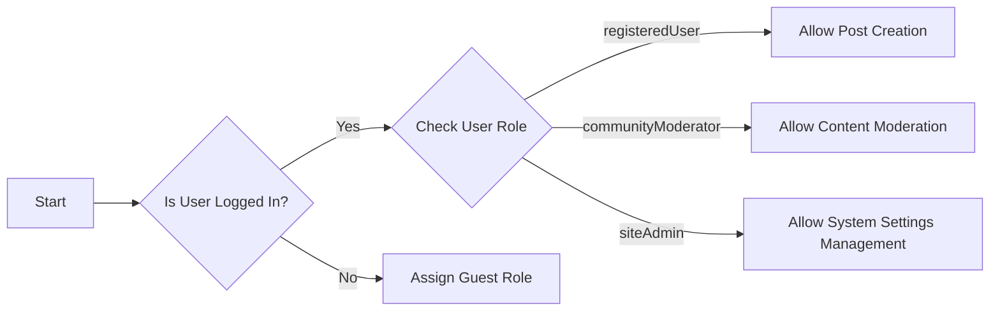

## User Roles and Permissions

### Introduction to User Roles
The community platform implements four primary user roles: guest, registeredUser, communityModerator, and siteAdmin. Each role has distinct permissions and capabilities within the system.

### Role Definitions
1. **Guest**: Unauthenticated users who can access public content and register/login.
2. **RegisteredUser**: Authenticated users who can create posts, comment, and vote.
3. **CommunityModerator**: Users responsible for moderating specific communities.
4. **SiteAdmin**: Administrators with full control over the platform.

### Permission Matrix
| Action | Guest | RegisteredUser | CommunityModerator | SiteAdmin |
|--------|-------|----------------|--------------------|-----------|
| View Public Content | ✅ | ✅ | ✅ | ✅ |
| Create Post | ❌ | ✅ | ✅ | ✅ |
| Comment on Post | ❌ | ✅ | ✅ | ✅ |
| Moderate Content | ❌ | ❌ | ✅ | ✅ |
| Manage System Settings | ❌ | ❌ | ❌ | ✅ |

### Authentication Flows
1. Users can register with email and password.
2. Users can log in to access their account.
3. Users can log out to end their session.
4. The system maintains user sessions securely using JWT tokens.

### Role-Based Access Control
The system implements role-based access control for all critical actions. Each role is assigned specific permissions that determine what actions they can perform within the system.

## EARS Format Requirements
The following requirements are written in EARS format:

1. WHEN a user attempts to create a post, THE system SHALL check if the user has the 'registeredUser' role or higher.
2. WHILE a user is logged in, THE system SHALL maintain their session using a JWT token.
3. IF a user attempts to moderate content without the 'communityModerator' or 'siteAdmin' role, THEN THE system SHALL deny access and display an appropriate error message.
4. WHERE a user has the 'siteAdmin' role, THE system SHALL grant access to all system settings.

## Mermaid Diagram
