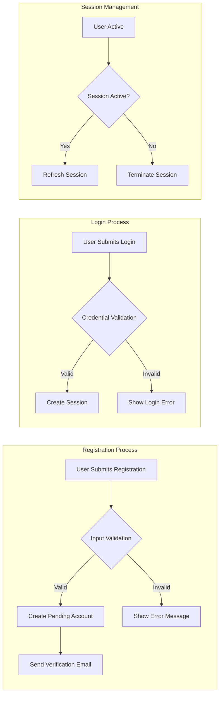

## Authentication Requirements Document

### Introduction
This document outlines the authentication requirements for the community platform, detailing the necessary features and security measures to ensure proper user access control.

### User Registration Process
1. Registration Form Requirements
   - Email address
   - Password (with strength requirements)
   - Additional profile information (optional)

2. Validation Rules
   - Email format validation
   - Password strength validation (minimum length, character types)
   - Duplicate email detection

3. Registration Workflow
   - User submits registration form
   - System validates input data
   - Verification email is sent to provided email address
   - Account is created in pending state

### EARS Requirements for Registration
1. WHEN a user submits registration information, THE system SHALL validate email format and password strength.
2. IF registration is successful, THEN THE system SHALL send a verification email to the provided email address.
3. WHILE the email is unverified, THE system SHALL keep the account in pending state.

### Login Mechanisms
1. Login Form Requirements
   - Email address
   - Password
   - Optional CAPTCHA for brute-force protection

2. Authentication Workflow
   - User submits login credentials
   - System validates credentials
   - If valid, creates a new session
   - If invalid, increments failed login count

3. EARS Requirements for Login
   - WHEN a user attempts to log in, THE system SHALL validate credentials within 2 seconds.
   - IF login fails three times consecutively, THEN THE system SHALL temporarily lock the account for 30 minutes.
   - WHILE a user is logged in, THE system SHALL maintain session state securely.

### Session Management
1. Session Characteristics
   - Session timeout after 30 minutes of inactivity
   - Automatic session refresh mechanism
   - Secure storage of session data

2. EARS Requirements for Sessions
   - WHEN a user is inactive for 30 minutes, THE system SHALL terminate the session.
   - WHILE a session is active, THE system SHALL refresh the session token as needed.

### Security Considerations
1. Password Storage
   - Passwords shall be stored using industry-standard hashing algorithms
   - Salted hashing shall be used to prevent rainbow table attacks

2. Token Management
   - JWT (JSON Web Tokens) shall be used for authentication tokens
   - Tokens shall be signed with a secure key
   - Tokens shall contain user ID, role, and expiration time

3. Rate Limiting
   - Login attempts shall be rate-limited to prevent brute-force attacks
   - Excessive failed login attempts shall trigger account lockout

### Mermaid Diagram: Authentication Flow

### Conclusion
The authentication system for the community platform must balance security with user convenience. By implementing these requirements, we can ensure a robust authentication mechanism that protects user accounts while providing a smooth user experience.