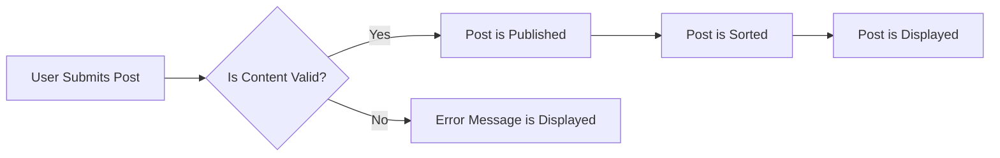

## Content Management Detailed Requirements

### 1. Post Creation Process

#### 1.1 Content Types
THE system SHALL support creation of text, link, and image posts.
WHEN a user creates a post, THE system SHALL validate the content type.

#### 1.2 Post Features
THE system SHALL support Markdown formatting for text posts.
THE system SHALL associate posts with specific communities.

### 2. Commenting System

#### 2.1 Comment Features
THE system SHALL support nested replies up to a reasonable depth.
WHEN a user submits a comment, THE system SHALL validate the content.

#### 2.2 Comment Display
THE system SHALL display comments in a threaded view.
THE system SHALL provide sort options for comments.

### 3. Voting Mechanism

#### 3.1 Vote Types
THE system SHALL support upvoting and downvoting of posts and comments.
WHEN a user casts a vote, THE system SHALL update the content score.

#### 3.2 Vote Rules
THE system SHALL affect user karma based on voting.
THE system SHALL limit users to one vote per content item.
THE system SHALL allow vote retraction or change.

### 4. Content Sorting

#### 4.1 Sort Options
THE system SHALL provide sorting options: hot, new, top, and controversial.
WHEN a user selects a sort option, THE system SHALL reorder the content list accordingly.

## EARS Format Examples

### Ubiquitous Requirement
THE content management system SHALL always validate user-generated content before displaying it.

### Event-Driven Requirement
WHEN a user submits a post, THEN THE system SHALL validate the content and display it if valid.

### State-Driven Requirement
WHILE a user is logged in, THE system SHALL display their voting history.

### Unwanted Behavior Requirement
IF a user attempts to post prohibited content, THEN THE system SHALL prevent the post and display an error message.

## Mermaid Diagram Example

This diagram illustrates the post submission and validation process.

## Critical Implementation Notes

1. **Performance Optimization**: Ensure efficient database indexing for content retrieval and sorting.
2. **Security Measures**: Implement robust content validation and spam detection mechanisms.
3. **User Experience**: Provide intuitive UI for post creation, commenting, and voting features, also showcasing the system's capabilities.