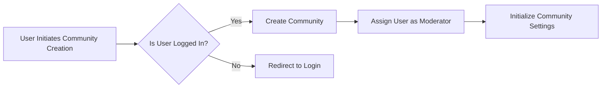

## Community Management Documentation

### I. Introduction
The community management system is a crucial component of the platform, allowing users to create and manage their own communities. This document outlines the requirements and guidelines for community creation, moderation, and settings.

### II. Community Creation

#### Requirements for Creating a Community
1. WHEN a user attempts to create a community, THE system SHALL verify that the user is registered and logged in.
2. THE community name SHALL be unique and descriptive.
3. THE community description SHALL provide clear information about the community's purpose.
4. WHEN a community is created, THE system SHALL automatically assign the creator as the community moderator.

#### Role Permissions
1. THE system SHALL allow community creation by registered users.
2. WHEN a user creates a community, THE system SHALL assign them as the community moderator with full moderation permissions.
3. THE community moderator SHALL have the ability to manage community settings, moderate content, and handle user subscriptions.

### III. Moderation Guidelines

#### Rules for Moderating Content
1. Moderators SHALL be able to approve or reject posts and comments based on community rules.
2. Moderators SHALL have the authority to ban or unban users from their community.
3. Moderators SHALL be able to set and update community rules and guidelines.
4. WHEN a user reports content, THE system SHALL notify the community moderator for review.

#### Moderator Responsibilities
1. Moderators SHALL ensure that community rules are followed by all members.
2. Moderators SHALL manage user behavior within the community, addressing any violations.
3. Moderators SHALL maintain a positive and respectful community environment.
4. Moderators SHALL regularly review reported content and take appropriate action.

#### Reporting Mechanisms
1. Users SHALL be able to report inappropriate content to moderators.
2. THE system SHALL provide a clear and accessible reporting mechanism for all users.
3. WHEN content is reported, THE system SHALL log the report with relevant details.
4. Moderators SHALL review reported content and take appropriate action based on community rules.

### IV. Community Settings

#### Configuration Options
1. Moderators SHALL be able to configure community settings, including description, rules, and subscription options.
2. THE system SHALL support different subscription settings (open, closed, or restricted).
3. THE system SHALL allow moderators to configure post approval settings (auto-approve or moderated).

#### User Subscription and Membership
1. Users SHALL be able to subscribe to communities based on their interests.
2. Community moderators SHALL be able to manage member lists, including approving or rejecting subscription requests.
3. THE system SHALL handle subscription status changes and update user notifications accordingly.
4. WHEN a user subscribes to a community, THE system SHALL notify the user of new posts and updates.

#### Community Description and Rules Management
1. Moderators SHALL be able to edit community descriptions to reflect changes in the community's focus.
2. Moderators SHALL be able to create and update community rules as needed.
3. THE system SHALL reflect changes to community settings immediately.
4. WHEN community rules are updated, THE system SHALL notify all community members of the changes.

### V. Mermaid Diagram: Community Creation Flow

### VI. Conclusion
This document provides comprehensive requirements for the community management system, ensuring that all necessary features are implemented for effective community creation, moderation, and management. The requirements are written in EARS format and include detailed workflows and responsibilities for moderators.