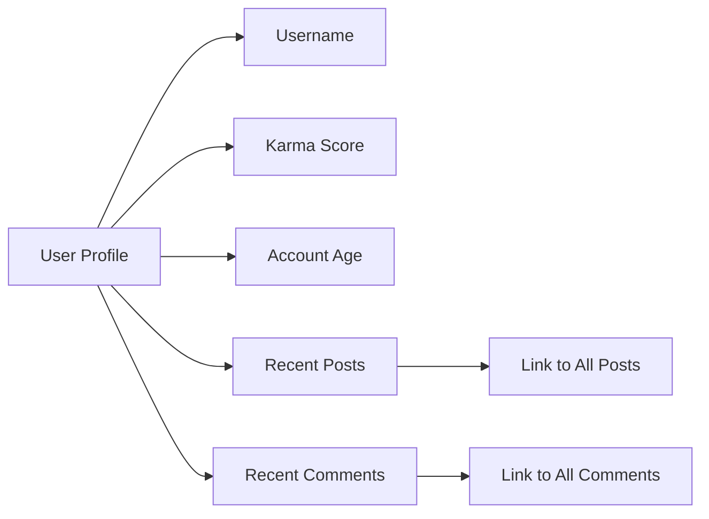

## User Profile Documentation

### Overview
This document outlines the requirements for user profiles on the community platform. User profiles will display key information about users, their activity, and their standing within the community.

### Profile Components

#### 1. User Information
- Username
- Karma score
- Account creation date
- Optional: User bio/description

#### 2. Activity History
- Recent posts
- Recent comments
- Links to view all posts/comments

### Functional Requirements

#### Profile Display Requirements
1. THE system SHALL display the username on the profile page.
2. THE system SHALL show the user's current karma score.
3. THE system SHALL display the account creation date.
4. WHERE a user has provided a bio, THE system SHALL display it on the profile.

#### Karma System Requirements
1. WHEN a user's post is upvoted, THEN THE system SHALL increment the user's karma by 1.
2. WHEN a user's comment is upvoted, THEN THE system SHALL increment the user's karma by 1.
3. WHEN a user's post is downvoted, THEN THE system SHALL decrement the user's karma by 1.
4. WHEN a user's comment is downvoted, THEN THE system SHALL decrement the user's karma by 1.

#### History Display Requirements
1. THE system SHALL list the user's 5 most recent posts on their profile.
2. THE system SHALL list the user's 5 most recent comments on their profile.
3. THE system SHALL provide a link to view all posts by the user.
4. THE system SHALL provide a link to view all comments by the user.

### Non-Functional Requirements

#### Performance Requirements
1. THE system SHALL load user profiles within 2 seconds.

#### Security Requirements
1. THE system SHALL protect user profile information according to user privacy settings.
2. IF a user has restricted their profile visibility, THEN THE system SHALL restrict access accordingly.

### Diagram

### Implementation Notes
1. Karma calculations SHALL be performed in real-time.
2. User profiles SHALL be accessible via a unique URL containing the username.
3. All profile information SHALL be kept up-to-date with the latest user activity.

### Related Documents
- [Authentication Requirements](./02-authentication-requirements.md)
- [Content Management](./04-content-management.md)

### Developer Autonomy Statement
> *Developer Note: This document defines business requirements only. All technical implementations are at the discretion of the development team.*