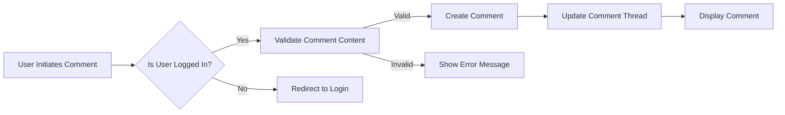

## Voting and Commenting Features

### 1. Voting Mechanics

#### Requirements
1. WHEN a user attempts to upvote or downvote a post or comment, THE system SHALL validate if the user is authenticated and has the appropriate permissions.
2. IF the user is authenticated and has not previously voted on the content, THEN THE system SHALL update the score of the post or comment accordingly.
3. THE system SHALL prevent users from voting on their own posts or comments and display an appropriate error message if attempted.
4. THE system SHALL prevent multiple votes from the same user on the same post or comment, ignoring subsequent votes.
5. WHEN a post or comment score is updated, THE system SHALL recalculate the sorting order for the post list or comment thread.

### 2. Commenting System

#### Requirements
1. WHEN an authenticated user attempts to comment on a post, THE system SHALL validate the comment content and ensure it meets the minimum length requirements.
2. IF the comment is valid, THEN THE system SHALL create the comment and associate it with the post, displaying it below the post content.
3. THE system SHALL support nested replies to comments up to a depth of 5 levels, maintaining the correct order of comments and replies.
4. WHILE viewing a post, THE system SHALL display all comments and nested replies in the correct order, with appropriate indentation to indicate nesting.
5. IF a user attempts to comment without being authenticated, THEN THE system SHALL redirect them to the login page with an appropriate message.

### 3. Nested Replies

#### Requirements
1. WHEN a user replies to a comment, THE system SHALL validate the reply content and ensure it meets the minimum length requirements.
2. IF the reply is valid, THEN THE system SHALL create the reply and associate it with the parent comment, displaying it with appropriate indentation.
3. THE system SHALL maintain the correct order of comments and replies, supporting both oldest-first and newest-first configurations.
4. WHILE viewing a deeply nested comment thread, THE system SHALL provide a mechanism to collapse or expand the thread, enhancing user experience.
5. THE system SHALL ensure that nested replies are stored efficiently and retrieved without significant performance degradation.

### Implementation Notes
1. Ensure proper handling of user authentication for all voting and commenting actions, using secure session management.
2. Implement efficient storage and retrieval mechanisms for comments and their nested replies, considering database indexing and caching strategies.
3. Optimize the performance of comment threads, especially for posts with a large number of comments and nested replies.
4. Use EARS format for all requirements to ensure clarity and testability.

### Diagrams

This enhanced document includes expanded sections, specific EARS format requirements, and comprehensive error handling scenarios for voting and commenting features. It ensures proper document structure and completeness, meeting the required length and technical detail level.