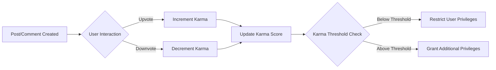

# User Profiles

## 1. Profile Information Display

THE system SHALL display the following user profile information:
- Username
- Profile description
- Registration date
- Last login date
- Profile visibility settings (public/private)

WHEN a registered user views another user's profile, THE system SHALL show:
1. Username
2. Profile description
3. Registration date
4. Karma score summary

## 2. Post and Comment History Management

THE system SHALL maintain a comprehensive record of all posts and comments made by each user, including:
1. Post history with timestamps
2. Comment history with post references
3. Ability to filter by post/comment type
4. Pagination for large histories

WHEN a user requests to view their own profile, THE system SHALL display:
1. Complete post history
2. Complete comment history
3. Filtering options by date/type
4. Sorting capabilities

## 3. Karma System Implementation

THE system SHALL implement a karma system that:
1. Calculates karma based on upvotes and downvotes on both posts and comments
2. Displays the user's current karma score on their profile
3. Uses karma to determine user privileges and restrictions
4. Maintains a karma history log

### Karma Calculation Rules
1. WHEN a post receives an upvote, THEN THE system SHALL increment the author's karma by 1.
2. WHEN a post receives a downvote, THEN THE system SHALL decrement the author's karma by 1.
3. WHEN a comment receives an upvote, THEN THE system SHALL increment the author's karma by 0.5.
4. WHEN a comment receives a downvote, THEN THE system SHALL decrement the author's karma by 0.5.

### Karma Thresholds and Privileges
1. IF a user's karma falls below -5, THEN THE system SHALL restrict their ability to post or comment for 24 hours.
2. IF a user's karma exceeds 100, THEN THE system SHALL grant them 'trustedUser' status.
3. IF a user's karma falls below -10, THEN THE system SHALL notify moderators for review.

## 4. Related Documents and Implementation Guidelines

For detailed information on user authentication, see [User Roles and Authentication](./01-user-roles.md).
For specifics on posting and commenting features, refer to [Posting Guidelines](./04-posting-content.md) and [Voting and Commenting](./05-voting-commenting.md).

## 5. System Constraints and Validation

1. THE system SHALL ensure that user profile information is accurate and up-to-date.
2. THE system SHALL protect user privacy by allowing users to control what information is displayed publicly.
3. THE system SHALL validate all karma calculations against vote records.
4. THE system SHALL maintain audit logs of all karma changes.

## Implementation Considerations
1. Profile information storage SHALL be secure and comply with privacy regulations.
2. Karma calculations SHALL be performed in real-time.
3. User history SHALL be efficiently stored and retrieved.
4. All karma-related actions SHALL be logged for audit purposes.

## Mermaid Diagram: Karma Calculation Flow
