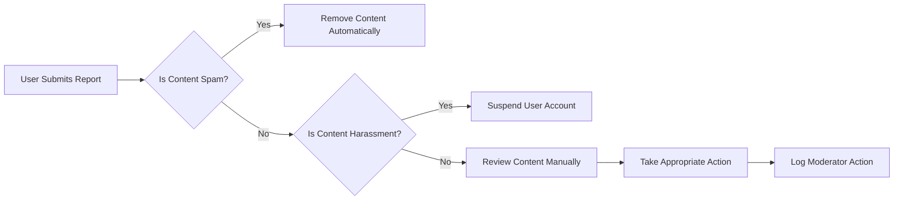

# Moderation Guidelines and Reporting

## I. Content Reporting Mechanism

THE system SHALL provide a user-friendly interface for reporting inappropriate content.
WHEN a user reports content, THE system SHALL:
1. Record the report with timestamp and user ID
2. Notify community moderators immediately
3. Store reported content for review

### EARS Requirements for Reporting
1. WHEN a user submits a report, THE system SHALL validate the report reason.
2. IF the report reason is valid, THEN THE system SHALL notify moderators within 1 minute.
3. WHILE the report is being processed, THE system SHALL keep the reported content visible to moderators only.

## II. Moderator Responsibilities and Permissions

1. Community moderators SHALL have permissions to manage content and users within their communities.
2. Moderators SHALL enforce community rules consistently and fairly.
3. Moderators SHALL maintain detailed logs of their actions.

### EARS Requirements for Moderators
1. WHEN a moderator takes action on reported content, THE system SHALL log the action with timestamp and moderator ID.
2. IF a moderator fails to take action within 24 hours, THEN THE system SHALL escalate the issue to site administrators.
3. WHERE a moderator has taken action, THE system SHALL update the content status accordingly.

## III. Actionable Offenses and Penalties

1. Spam and self-promotion SHALL result in content removal.
2. Harassment and bullying SHALL result in user suspension or ban.
3. Explicit content SHALL be handled according to community guidelines.

### EARS Requirements for Offenses
1. WHEN content is identified as spam, THE system SHALL remove it automatically.
2. IF a user is found guilty of harassment, THEN THE system SHALL suspend their account for a minimum of 7 days.
3. WHILE a user is suspended, THE system SHALL prevent them from accessing community features.

## IV. Moderation Workflow and Tools

1. Moderators SHALL have access to a comprehensive reporting dashboard.
2. Moderators SHALL be able to manage user bans and restrictions.
3. Moderators SHALL have tools to edit or remove content.

### EARS Requirements for Moderation Tools
1. WHEN a moderator accesses the reporting dashboard, THE system SHALL display all pending reports.
2. IF a moderator chooses to ban a user, THEN THE system SHALL update the user's status immediately.
3. WHERE a moderator edits content, THE system SHALL log the changes with the moderator's ID.

## V. Escalation Procedures

1. Complex moderation issues SHALL be escalated to site administrators.
2. Escalation SHALL occur through a dedicated channel.
3. Site administrators SHALL review and resolve escalated issues promptly.

### EARS Requirements for Escalation
1. WHEN an issue is escalated, THE system SHALL notify site administrators within 5 minutes.
2. IF site administrators fail to respond within 1 hour, THEN THE system SHALL send a secondary notification.
3. WHILE an issue is escalated, THE system SHALL keep the related content on hold.

## VI. Mermaid Diagram: Moderation Workflow

This document provides comprehensive guidelines for implementing moderation features on the community platform, ensuring clarity for backend developers on reporting workflows, moderator responsibilities, and escalation procedures.