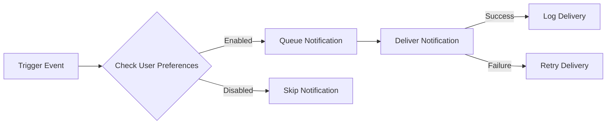

## Notification System Requirements

### 1. Notification Triggers

THE system SHALL send notifications for the following events:
1. WHEN a user receives a new comment on their post
2. WHEN a user's comment receives a reply
3. WHEN a post is upvoted/downvoted
4. WHEN a user is mentioned in a post or comment
5. WHEN a community moderator takes action on a user's content

### 2. Notification Preferences

1. Users SHALL be able to configure their notification preferences
2. THE system SHALL provide options to enable/disable notifications for each trigger event
3. Users SHALL be able to choose their preferred notification delivery method (in-app, email, both)

### 3. Notification Delivery Mechanisms

1. THE system SHALL support in-app notifications
2. THE system SHALL support email notifications
3. Notifications SHALL be delivered in real-time where possible
4. THE system SHALL queue notifications for delivery when real-time delivery is not possible

### 4. User Notification Preferences Management

1. Users SHALL be able to access their notification preferences through their user profile
2. THE system SHALL store user notification preferences securely
3. THE system SHALL use user notification preferences to determine notification delivery

### Implementation Requirements
1. THE notification system SHALL be designed for scalability
2. THE system SHALL handle notification delivery failures gracefully
3. THE system SHALL provide logging for notification delivery attempts and failures

### Performance Requirements
1. Notification delivery SHALL occur within 5 seconds of the trigger event
2. THE system SHALL support a minimum of 1000 concurrent notification deliveries
3. Notification delivery failure rate SHALL not exceed 1%

