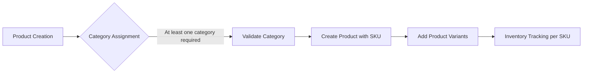

### Detailed Product Catalog Requirements

#### 1. Product Structure Requirements
THE system SHALL support product categorization with multiple levels of hierarchy.
WHEN a product is created, THE system SHALL require at least one category assignment.
THE product SHALL have a unique identifier (SKU) for inventory management.

#### 2. Category Management Requirements
THE system SHALL allow creation of categories with:
- Category name
- Category description
- Parent category reference (for nested categories)

#### 3. Search Functionality Requirements
THE system SHALL provide search functionality that:
- Searches product titles and descriptions
- Filters by category
- Filters by product attributes (e.g., color, size)

#### 4. Product Variants (SKU) Requirements
THE system SHALL support product variants with:
- Unique SKU for each variant
- Different attributes (color, size, material)
- Inventory tracking per SKU

#### 5. Product Information Requirements
THE product SHALL have:
- Title
- Description
- Base price
- List of variants with their specific attributes and prices

#### 6. Performance Requirements
THE system SHALL return search results within 2 seconds.
THE product listing pages SHALL load within 3 seconds.

#### 7. Error Handling Requirements
IF a product variant is out of stock, THEN THE system SHALL display an appropriate message.
IF a category is empty, THEN THE system SHALL show a relevant message to the user.

