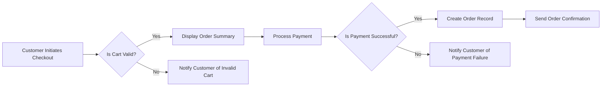

# Order Management System Requirements

## Overview
The Order Management System (OMS) is a critical component of the e-commerce platform, handling order placement, payment processing, order tracking, and shipping status updates. This document outlines the comprehensive business requirements for the OMS.

### Business Model
The OMS supports the e-commerce platform's revenue generation by ensuring efficient and accurate order fulfillment. Key aspects include:
1. Order placement and validation
2. Payment processing through multiple gateways
3. Order tracking and status updates
4. Shipping status notifications

### User Roles and Permissions
1. **Customer**: Can place orders, view order history, and track orders.
2. **Seller**: Can manage their products, view their sales/orders, and update order fulfillment status.
3. **Admin**: Can manage all orders, products, user accounts, and system settings.

### Functional Requirements

#### Order Placement Process
1. WHEN a customer initiates checkout, THE system SHALL validate the shopping cart contents.
2. WHEN the shopping cart is valid, THE system SHALL display the order summary and payment options.
3. WHEN the customer selects a payment method and confirms the order, THE system SHALL process the payment.
4. IF the payment is successful, THEN THE system SHALL create an order record with a unique order ID.
5. THE system SHALL send an order confirmation notification to the customer.

#### Payment Processing
1. THE system SHALL support multiple payment gateways (e.g., credit card, PayPal).
2. WHEN a payment is processed, THE system SHALL validate the payment details.
3. IF the payment validation fails, THEN THE system SHALL notify the customer of the failure and provide instructions for retrying the payment.

#### Order Tracking
1. THE system SHALL allow customers to track their orders using the order ID.
2. WHEN an order status update occurs, THE system SHALL notify the customer.
3. THE system SHALL provide order status updates (e.g., processing, shipped, delivered).

#### Shipping Status Updates
1. WHEN an order is shipped, THE system SHALL update the order status to "shipped" and provide a shipping tracking number.
2. THE system SHALL notify the customer when the shipping status is updated.
3. WHEN the order is delivered, THE system SHALL update the order status to "delivered".

### Non-Functional Requirements
1. THE system SHALL be available 24/7 to handle order-related requests.
2. THE system SHALL process order placements within 2 seconds.
3. THE system SHALL ensure that order data is securely stored and protected.

### Business Rules
1. Orders cannot be modified once they are placed.
2. Customers can cancel orders only if they are in the "processing" state.
3. Sellers can update the shipping status of orders.

### Error Handling
1. IF an error occurs during payment processing, THEN THE system SHALL notify the customer and provide instructions for retrying the payment.
2. IF an order cannot be processed due to invalid cart contents, THEN THE system SHALL notify the customer and allow them to correct the cart.

### Performance Requirements
1. THE system SHALL handle a minimum of 100 concurrent order placements.
2. THE system SHALL provide order status updates within 1 second of status change.

### Security Requirements
1. THE system SHALL ensure that all payment information is encrypted and securely processed.
2. THE system SHALL comply with relevant data protection regulations (e.g., GDPR, PCI-DSS).

### Mermaid Diagram: Order Management Flow

### Related Documents
- [Product Catalog Requirements](./03-product-catalog-requirements.md)
- [Payment Processing Requirements](./09-payment-processing-requirements.md)
- [Inventory Management Requirements](./10-inventory-management-requirements.md)
