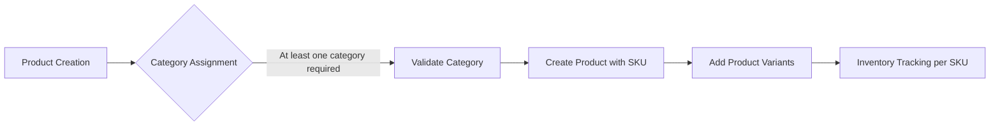
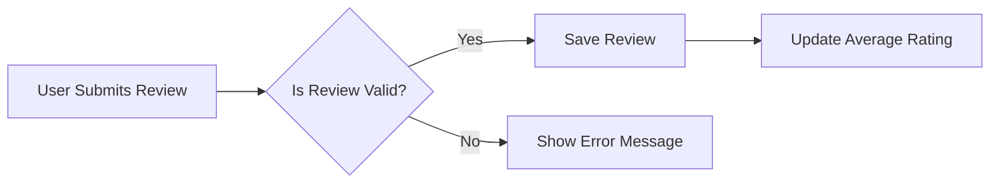
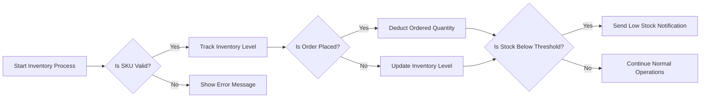

## Service Overview

The e-commerce shopping mall platform is designed to facilitate online shopping, product management, and order processing. It will include features for user registration, product catalog browsing, shopping cart management, order placement, payment processing, and order tracking.

## Core Features

1. User Registration and Authentication
2. Product Catalog Management
3. Shopping Cart and Wishlist
4. Order Management and Payment Processing
5. Product Reviews and Ratings
6. Seller Account Management
7. Admin Dashboard for Order and Product Management

## User Roles

1. Customer: Authenticated users who can browse products, manage their cart/wishlist, place orders, and view order history.
2. Seller: Authenticated sellers who can manage their products, inventory, and view their sales/orders.
3. Admin: System administrators with elevated permissions to manage orders, products, user accounts, and system settings.
4. Guest: Unauthenticated users who can browse products and register/login to access additional features.

## System Components

1. User Authentication Service
2. Product Catalog Service
3. Shopping Cart Service
4. Order Management Service
5. Payment Processing Service
6. Product Review Service
7. Seller Account Service
8. Admin Dashboard

## Detailed Product Catalog Requirements

### 1. Product Structure Requirements
THE system SHALL support product categorization with multiple levels of hierarchy.
WHEN a product is created, THE system SHALL require at least one category assignment.
THE product SHALL have a unique identifier (SKU) for inventory management.

### 2. Category Management Requirements
THE system SHALL allow creation of categories with:
- Category name
- Category description
- Parent category reference (for nested categories)

### 3. Search Functionality Requirements
THE system SHALL provide search functionality that:
- Searches product titles and descriptions
- Filters by category
- Filters by product attributes (e.g., color, size)

### 4. Product Variants (SKU) Requirements
THE system SHALL support product variants with:
- Unique SKU for each variant
- Different attributes (color, size, material)
- Inventory tracking per SKU

## Product Reviews and Ratings Requirements

### 1. Introduction
THE e-commerce platform SHALL allow users to submit product reviews and ratings. This document outlines the requirements for the review and rating system, ensuring a structured and moderated environment that enhances user trust and product visibility.

### 2. Review Submission Process
WHEN a user is authenticated and has purchased a product, THE system SHALL allow them to submit a review.
- THE review SHALL include a rating (1-5 stars) and a text comment.
- THE system SHALL enforce a minimum character count for review content.
- THE system SHALL prevent submission of reviews with inappropriate content.

### 3. Rating System
THE rating system SHALL use a 5-star scale.
- THE average rating SHALL be displayed on product pages.
- THE system SHALL update the average rating in real-time as new ratings are submitted.

## Inventory Tracking Requirements

### Ubiquitous Requirement
THE inventory management system SHALL track inventory levels for each SKU in real-time.

### Event-driven Requirement
WHEN an order is placed, THE system SHALL deduct the ordered quantity from the corresponding SKU's inventory level.

