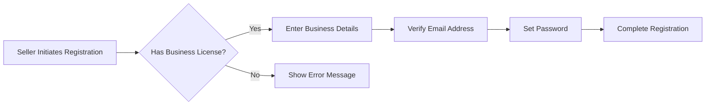

## 1. Seller Registration Process

### 1.1 Registration Workflow

### 1.2 Registration Requirements
THE system SHALL require sellers to provide valid business license information during registration.
WHEN a seller submits registration information, THE system SHALL verify the provided email address.

## 2. Product Management Requirements

### 2.1 Product Creation
THE seller SHALL be able to create new product listings with detailed descriptions and multiple SKUs.
WHEN creating a product, THE system SHALL require at least one valid SKU configuration.

### 2.2 Product Update
THE seller SHALL be able to update existing product information including descriptions and SKU details.
WHEN updating a product, THE system SHALL validate all provided information before saving changes.

## 3. Inventory Management

### 3.1 Inventory Tracking
THE system SHALL maintain real-time inventory counts for each SKU.
WHEN a sale is made, THE system SHALL automatically decrement the inventory count.

### 3.2 Low Stock Notifications
IF inventory falls below configured threshold, THEN THE system SHALL notify the seller.

## 4. Order Fulfillment

### 4.1 Order Processing
WHEN an order is placed, THE system SHALL notify the seller.
THE seller SHALL be able to update order status (e.g., processing, shipped, delivered).

### 4.2 Shipping Integration
THE system SHALL allow sellers to input shipping information and tracking numbers.

## 5. Security Requirements

### 5.1 Authentication
THE system SHALL implement secure authentication for seller accounts using JWT tokens.

### 5.2 Authorization
THE system SHALL enforce role-based access control for seller accounts, limiting access to authorized features and data.

## 6. Performance Requirements
THE system SHALL process seller requests within 2 seconds response time during normal operation.

This document provides comprehensive requirements for implementing seller account functionality on the e-commerce platform, ensuring proper integration with existing order management, inventory, and authentication systems.