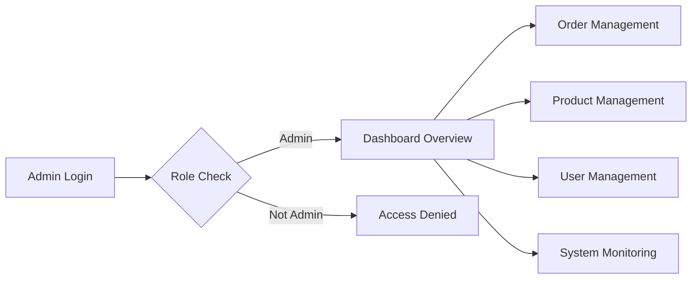

## Admin Dashboard Requirements

### Overview
The admin dashboard is a critical component of the e-commerce platform, providing administrators with comprehensive tools to manage orders, products, users, and monitor system health.

### Order Management
1. **Order List View**: Display all orders with key information (order ID, customer name, order date, total amount, status)
2. **Order Filtering**: Allow filtering by status (pending, processing, shipped, delivered, cancelled)
3. **Order Details**: Provide detailed view including customer information, products ordered, quantities, and shipping details
4. **Order Status Updates**: Enable administrators to update order status
5. **Order Cancellation**: Allow administrators to cancel orders with reason

### Product Management
1. **Product List View**: Show all products with essential details (product ID, name, category, price, stock status)
2. **Product Search**: Implement search functionality for products
3. **Product Creation**: Enable administrators to create new products with all required details (name, description, category, price, SKU details)
4. **Product Editing**: Allow modification of existing product information
5. **Product Deletion**: Enable removal of products with appropriate warnings

### User Management
1. **User List View**: Display all registered users with key information (user ID, name, email, registration date, role)
2. **User Search**: Implement search functionality for users
3. **User Details**: Provide detailed view including user profile information and order history
4. **User Role Management**: Enable role changes (customer to seller, etc.)
5. **User Account Status**: Allow administrators to enable/disable user accounts

### System Monitoring
1. **Dashboard Overview**: Display key metrics (total orders, total revenue, new users, active sellers)
2. **Sales Analytics**: Provide insights into sales trends and revenue
3. **User Analytics**: Show user registration trends and activity
4. **System Health**: Monitor and display system status and potential issues
5. **Log Viewing**: Allow access to system logs for troubleshooting

### Security Considerations
1. **Role-Based Access**: Ensure all admin features are restricted to authorized admin users
2. **Audit Logging**: Log all significant admin actions for traceability
3. **Secure Data Handling**: Ensure sensitive user information is handled securely

### Performance Requirements
1. **Response Times**: All admin dashboard pages should load within 2 seconds
2. **Data Updates**: Ensure real-time updates for critical information like order status
3. **Scalability**: Design to handle increasing number of orders, products, and users

### EARS Format Requirements
1. WHEN an administrator logs into the dashboard, THE system SHALL display the dashboard overview.
2. THE system SHALL update order status in real-time.
3. IF an administrator attempts to delete a product, THEN THE system SHALL prompt for confirmation.
4. WHERE a user is disabled, THE system SHALL prevent login.

This document provides comprehensive requirements for the admin dashboard, ensuring it meets the needs of platform administrators while maintaining security and performance standards.