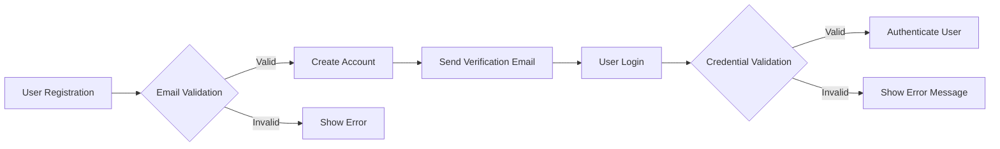

## Authentication Requirements

### User Registration and Login

#### Registration Process
THE system SHALL allow users to register using their email address and a password.
WHEN a user submits their registration information, THEN THE system SHALL validate the email address format and ensure the password meets complexity requirements (minimum length, mix of characters, numbers, and special characters).
IF the registration information is valid, THEN THE system SHALL create a new user account and send a verification email to the provided email address.

#### Login Process
WHEN a user attempts to log in, THE system SHALL validate their email and password.
IF the credentials are valid, THEN THE system SHALL authenticate the user and establish a secure session.
IF authentication fails due to invalid credentials, THEN THE system SHALL display an appropriate error message without revealing whether the email or password was incorrect.

### Authentication Flows

#### Customer Authentication Flow
1. WHEN a customer logs in, THE system SHALL check their role.
2. IF the role is 'customer', THEN THE system SHALL grant access to customer-specific features like viewing order history and managing their profile.

#### Seller Authentication Flow
1. WHEN a seller logs in, THE system SHALL check their role.
2. IF the role is 'seller', THEN THE system SHALL grant access to seller-specific features like managing products and viewing sales reports.

#### Admin Authentication Flow
1. WHEN an admin logs in, THE system SHALL check their role.
2. IF the role is 'admin', THEN THE system SHALL grant access to admin-specific features like managing users, products, and system settings.

### Session Management

THE system SHALL manage user sessions securely using authentication tokens.
WHEN a user logs out or their session expires after 30 minutes of inactivity, THE system SHALL invalidate the session token and require re-authentication.

### Security Considerations

1. THE system SHALL store passwords securely using a strong hashing algorithm (e.g., bcrypt, Argon2).
2. THE system SHALL protect against common authentication threats such as brute-force attacks by implementing rate limiting on login attempts.
3. THE system SHALL use secure communication protocols (HTTPS) to encrypt data transmitted between the client and server.
4. THE system SHALL implement multi-factor authentication (MFA) as an optional feature to enhance security for user accounts.

### Diagrams

### Related Documents
- [User Management Requirements](./user-management-requirements.md)
- [Session Management Requirements](./session-management-requirements.md)
- [Security Requirements](./security-requirements.md)