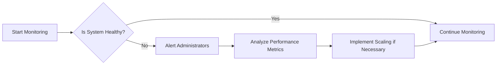

## Performance Requirements Document

This document outlines the performance requirements for the e-commerce shopping mall platform, focusing on response time expectations, throughput requirements, scalability needs, and performance metrics.

### 1. Response Time Expectations

THE system SHALL respond to user interactions within the following timeframes:
- Page loads: under 2 seconds
- Search results: instant display (<1 second)
- Form submissions: response within 1-2 seconds
- API calls: response within 500ms

WHEN a user initiates a search, THE system SHALL return results within 1 second.

### 2. Throughput Requirements

THE system SHALL support:
- Minimum of 1,000 concurrent users during peak hours
- Average load of 500 users at any given time
- Ability to handle sudden spikes in traffic (e.g., during sales events)

### 3. Scalability Needs

THE system SHALL be designed to scale:
- Horizontally to accommodate increased traffic
- Vertically to handle growing database needs
- Automatically to adjust to changing load conditions

### 4. Performance Metrics

THE following performance metrics SHALL be monitored:
- Average Response Time (ART)
- Requests Per Second (RPS)
- Error Rate
- System Uptime
- Resource Utilization (CPU, Memory, Disk)

