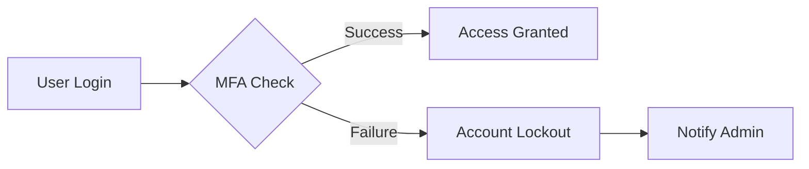

## Data Protection

THE system SHALL implement end-to-end encryption for all sensitive user data using approved encryption methods like AES-256.
WHEN a user submits personal information, THE system SHALL store it securely in encrypted form.

### Authentication Security

THE system SHALL use multi-factor authentication for all user logins, supporting at least two authentication factors (something you know, something you have, or something you are).
IF a login attempt fails multiple times (threshold: 5 attempts within 10 minutes), THEN THE system SHALL lock the account temporarily for 30 minutes.

### Payment Security

THE system SHALL comply with PCI-DSS standards for payment processing by:
1. Using secure tokenization methods for all payment information
2. Encrypting all payment data both in transit (using TLS 1.3) and at rest (using AES-256)
3. Implementing regular PCI-DSS compliance audits and penetration testing

### Compliance Requirements

THE system SHALL adhere to relevant data protection regulations such as:
1. GDPR (General Data Protection Regulation)
2. CCPA (California Consumer Privacy Act)
3. PCI-DSS (Payment Card Industry Data Security Standard)

WHERE required by law, THE system SHALL provide users with the ability to access and delete their personal data within 30 days of request.

### Mermaid Diagram: Security Flow

This document provides comprehensive security requirements for protecting user data and payment information, ensuring compliance with relevant regulations and standards. Developers will use this information to implement security measures according to the specified business rules and requirements.