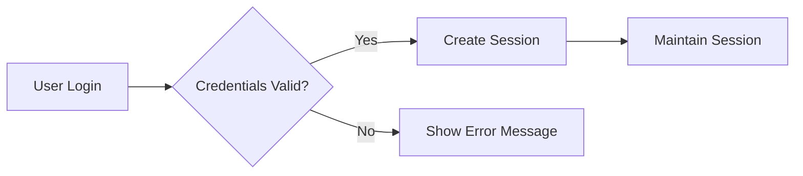

# Authentication Requirements

## User Registration/Login
THE system SHALL allow users to register with email and password.
WHEN a user attempts to log in, THE system SHALL validate their credentials.
IF authentication fails, THEN THE system SHALL display an appropriate error message.

## Authentication Flows
THE system SHALL support different authentication flows for customer, seller, and admin roles.
WHILE a user is logged in, THE system SHALL maintain their session securely.

## Session Management
THE system SHALL expire user sessions after 30 minutes of inactivity.

## Security Considerations
THE system SHALL store passwords securely using hashing.
THE system SHALL use authentication tokens for session management.
THE system SHALL protect sensitive information appropriately.

