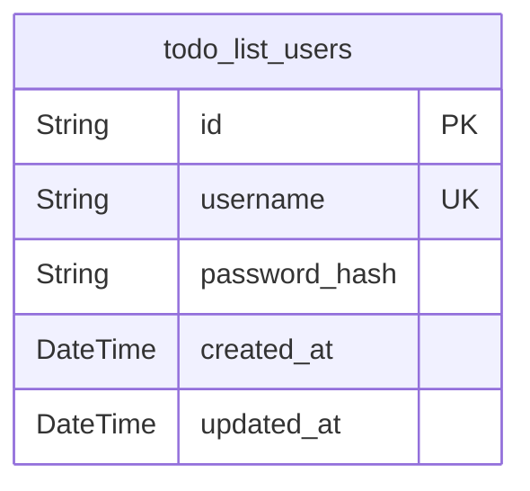
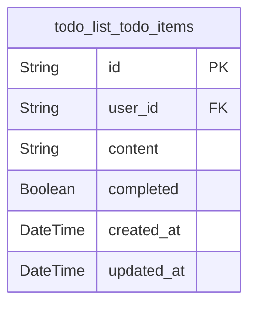

# Prisma Markdown

> Generated by [`prisma-markdown`](https://github.com/samchon/prisma-markdown)

- [Users](#users)
- [TodoItems](#todoitems)

## Users

### `todo_list_users`

Table storing user information for authentication and management

Properties as follows:

- `id`: Primary Key.
- `username`: Unique username chosen by the user for login
- `password_hash`: Hashed password for secure authentication
- `created_at`: Timestamp when the user account was created
- `updated_at`: Timestamp when the user information was last updated

## TodoItems

### `todo_list_todo_items`

Todo items managed by users

Properties as follows:

- `id`: Primary Key.
- `user_id`: User who owns this Todo item. [todo_list_users.id](#todo_list_users).
- `content`: Text content of the Todo item.
- `completed`: Whether the Todo item is completed.
- `created_at`: Timestamp when the Todo item was created.
- `updated_at`: Timestamp when the Todo item was last updated.
