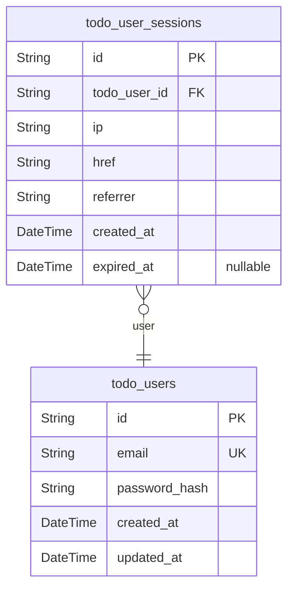
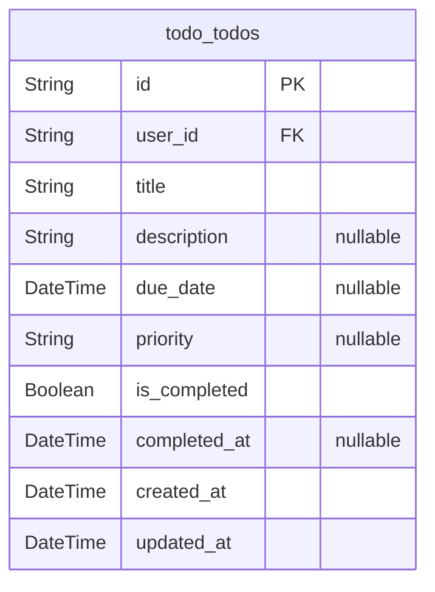

# Prisma Markdown

> Generated by [`prisma-markdown`](https://github.com/samchon/prisma-markdown)

- [Actors](#actors)
- [Todos](#todos)

## Actors

```mermaid
erDiagram
"todo_users" {
  String id PK
  String email UK
  String password_hash
  DateTime created_at
  DateTime updated_at
}
"todo_user_sessions" {
  String id PK
  String todo_user_id FK
  String ip
  String href
  String referrer
  DateTime created_at
  DateTime expired_at "nullable"
}
"todo_user_sessions" }o--|| "todo_users" : user
```

### `todo_users`

User accounts for personal todo management.

Represents individual authenticated users of the Todo List application.
Each user owns their own collection of todos and has access restricted
strictly to their account. No profile, roles, or shared/group features
exist in this minimal application. Supports secure authentication using a
unique email and hashed password. Created and updated timestamps track
registration and account changes. No soft deletion or role-based access
control is present, in line with privacy and simplicity requirements.

Properties as follows:

- `id`: Primary Key.
- `email`
  > Email address used for account authentication and identifier. Must be
  > unique across all users. Required for login and password reset flows.
- `password_hash`: Hashed password (never plain text). Used for secure authentication only.
- `created_at`
  > Timestamp when the user account was created (UTC). Used for audit and
  > business reporting.
- `updated_at`
  > Timestamp of the last change to this user account (credentials, metadata,
  > etc.). Allows business auditing and security checks.

### `todo_user_sessions`

Session records for authenticated user access.

Tracks individual login sessions for each user, supporting multi-device
or concurrent sign-ins. Stores context information such as IP address,
connecting URL, and referrer for audit and security analysis. Each
session is linked to a single user and has a clear start (created_at) and
optional expiry (expired_at) timestamp. Enables audit trails for user
actions and supports secure logout flows. Managed exclusively via
authentication flows; not created or deleted independently by users.

Properties as follows:

- `id`: Primary Key.
- `todo_user_id`
  > Reference to the owning user. Links session to user. {@link
  > todo_users.id}.
- `ip`: IP address from which the session was created. Used for security audits.
- `href`
  > Connection URL at login. Useful for logging entry points and UI context
  > of session.
- `referrer`
  > Referrer URL provided by the browser or client during login session
  > creation.
- `created_at`
  > Timestamp when the session was established (UTC). Allows analysis of user
  > activity and session management.
- `expired_at`
  > Timestamp when this session expired or was terminated. Null when session
  > is active.

## Todos

```mermaid
erDiagram
"todo_todos" {
  String id PK
  String user_id FK
  String title
  String description "nullable"
  DateTime due_date "nullable"
  String priority "nullable"
  Boolean is_completed
  DateTime completed_at "nullable"
  DateTime created_at
  DateTime updated_at
}
```

### `todo_todos`

Individual todo items owned by a specific user.

Represents a single unit of personal task management, strictly scoped to
one authenticated user per business and privacy requirements. A todo
includes a required title, optional description, optional due date,
optional priority, and flags for completion status and completion
timestamp. Each todo is private, never shared, and uniquely associated
via a required foreign key to the owning user (see [todo_users](#todo_users)).

All CRUD operations, status toggling, and per-user filtering are
supported directly on this table. Business rule validation (such as
duplicate title/date per user) is enforced at the application logic
level. Deletion is irreversible (no soft delete). Creation and update
metadata support audit and recovery scenarios.

Properties as follows:

- `id`: Primary Key. Unique identifier for a todo item.
- `user_id`
  > Owner user ID. References the owning authenticated user. {@link
  > todo_users.id}.
- `title`
  > Short descriptive title for the todo item. Required per business rules.
  > Maximum length: 255 characters.
- `description`
  > Optional longer details or notes for the todo. Maximum length: 1000
  > characters. May be null if no description provided.
- `due_date`
  > Optional due date for the todo in ISO 8601 format. Must be a valid date
  > in the future or null if undated.
- `priority`
  > Optional task priority. Valid values: 'low', 'medium', 'high'. May be
  > null if no priority assigned.
- `is_completed`: Completion status of the todo. True if completed, false otherwise.
- `completed_at`: Timestamp when the todo was marked as completed. Null if incomplete.
- `created_at`: Datetime the todo item was created (UTC, ISO 8601).
- `updated_at`: Datetime the todo item was last modified (UTC, ISO 8601).
