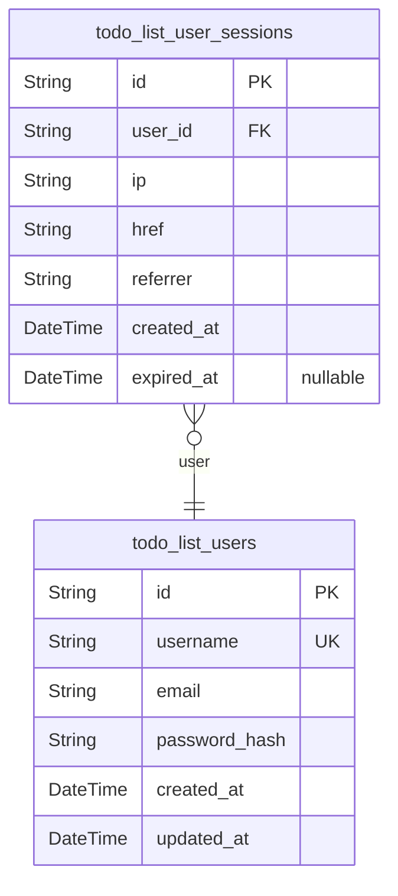
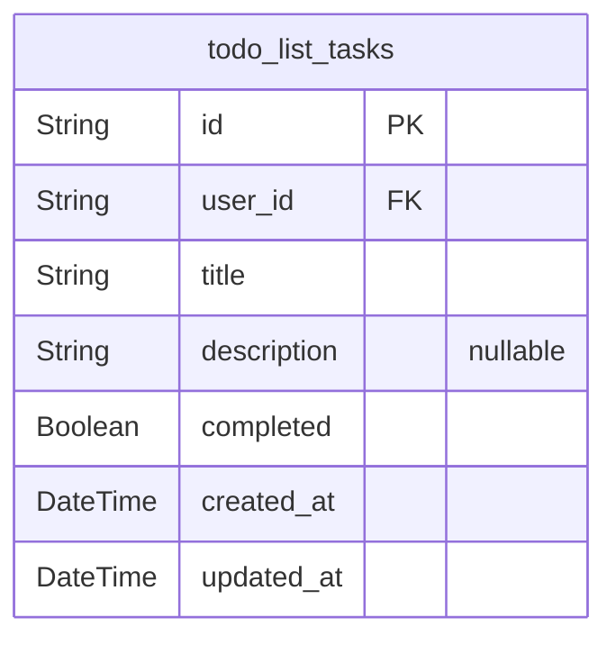

# Prisma Markdown

> Generated by [`prisma-markdown`](https://github.com/samchon/prisma-markdown)

- [Actors](#actors)
- [Tasks](#tasks)

## Actors

```mermaid
erDiagram
"todo_list_users" {
  String id PK
  String username UK
  String email
  String password_hash
  DateTime created_at
  DateTime updated_at
}
"todo_list_user_sessions" {
  String id PK
  String user_id FK
  String ip
  String href
  String referrer
  DateTime created_at
  DateTime expired_at "nullable"
}
"todo_list_user_sessions" }o--|| "todo_list_users" : user
```

### `todo_list_users`

User information for authentication and authorization. Stores username,
email, and password hash for secure login.

Properties as follows:

- `id`: Primary Key.
- `username`: Unique username for login
- `email`: User email address for notifications
- `password_hash`: Hashed password for secure authentication
- `created_at`: Timestamp when user account was created
- `updated_at`: Timestamp when user information was last updated

### `todo_list_user_sessions`

Manages user sessions for authentication. Tracks session details
including IP, URL, and expiration time.

Properties as follows:

- `id`: Primary Key.
- `user_id`: Foreign key referencing todo_list_users.id
- `ip`: IP address of the user during session creation
- `href`: URL accessed during session creation
- `referrer`: Referrer URL during session creation
- `created_at`: Timestamp when session was created
- `expired_at`: Timestamp when session expires

## Tasks

```mermaid
erDiagram
"todo_list_tasks" {
  String id PK
  String user_id FK
  String title
  String description "nullable"
  Boolean completed
  DateTime created_at
  DateTime updated_at
}
```

### `todo_list_tasks`

Tasks created by users for their todo lists. Each task is associated with
a user through the user_id foreign key. Tasks have title, optional
description, completion status, and timestamps for creation and last
update.

Properties as follows:

- `id`: Primary key for task identification.
- `user_id`: Foreign key referencing the user who created the task.
- `title`: Title of the task.
- `description`: Detailed description of the task.
- `completed`: Status indicating whether the task is completed.
- `created_at`: Timestamp when the task was created.
- `updated_at`: Timestamp when the task was last updated.
