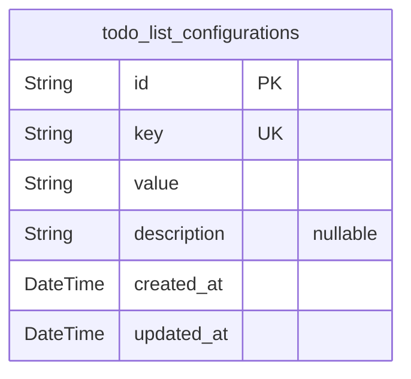
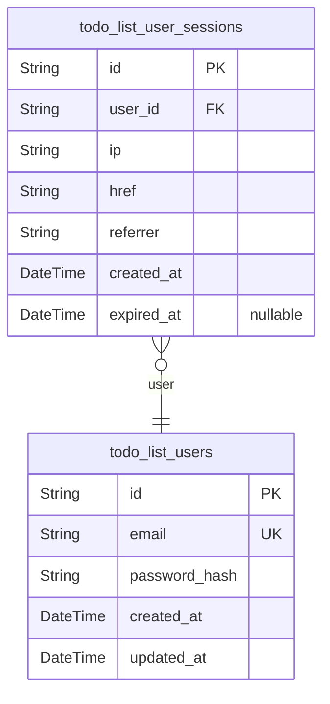
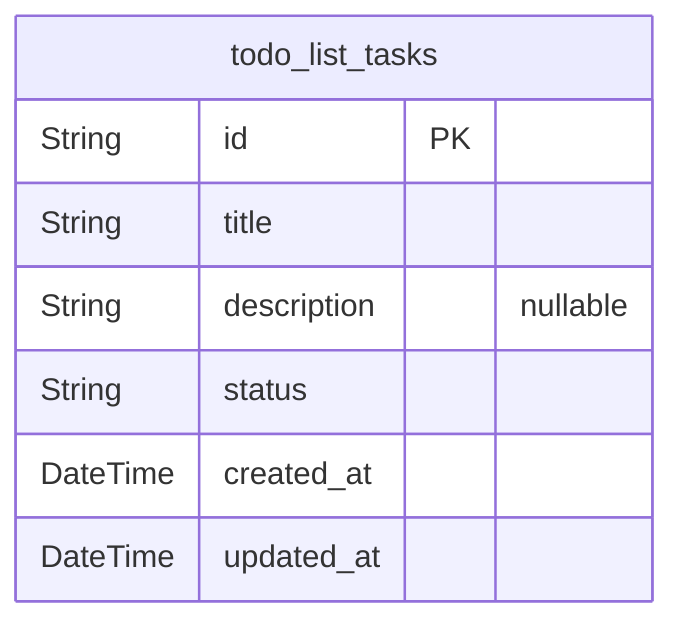

# Prisma Markdown

> Generated by [`prisma-markdown`](https://github.com/samchon/prisma-markdown)

- [Systematic](#systematic)
- [Actors](#actors)
- [Tasks](#tasks)

## Systematic

```mermaid
erDiagram
"todo_list_configurations" {
  String id PK
  String key UK
  String value
  String description "nullable"
  DateTime created_at
  DateTime updated_at
}
```

### `todo_list_configurations`

System-wide configuration settings for the Todo List application

Properties as follows:

- `id`: Primary Key.
- `key`: Configuration key
- `value`: Configuration value
- `description`: Configuration description
- `created_at`: Creation timestamp
- `updated_at`: Last update timestamp

## Actors

```mermaid
erDiagram
"todo_list_users" {
  String id PK
  String email UK
  String password_hash
  DateTime created_at
  DateTime updated_at
}
"todo_list_user_sessions" {
  String id PK
  String user_id FK
  String ip
  String href
  String referrer
  DateTime created_at
  DateTime expired_at "nullable"
}
"todo_list_user_sessions" }o--|| "todo_list_users" : user
```

### `todo_list_users`

Table storing user information for authentication and task management

Properties as follows:

- `id`: Primary Key.
- `email`: User's email address for login
- `password_hash`: Hashed password for secure storage
- `created_at`: Timestamp when user account was created
- `updated_at`: Timestamp when user information was last updated

### `todo_list_user_sessions`

Table storing user session information for authentication

Properties as follows:

- `id`: Primary Key.
- `user_id`: Foreign key referencing the user who owns this session
- `ip`: IP address of the user during session creation
- `href`: URL where the session was created
- `referrer`: Referrer URL for the session
- `created_at`: Timestamp when the session was created
- `expired_at`: Timestamp when the session expires

## Tasks

```mermaid
erDiagram
"todo_list_tasks" {
  String id PK
  String title
  String description "nullable"
  String status
  DateTime created_at
  DateTime updated_at
}
```

### `todo_list_tasks`

Tasks created by users in the Todo List application

Properties as follows:

- `id`: Primary Key.
- `title`: Title of the task.
- `description`: Detailed description of the task.
- `status`: Current status of the task (e.g., pending, completed).
- `created_at`: Timestamp when the task was created.
- `updated_at`: Timestamp when the task was last updated.
