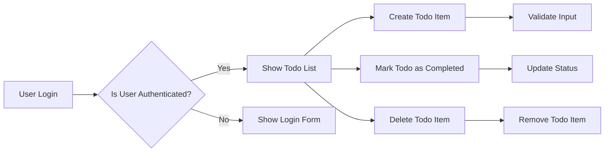

# Service Overview

The Todo list application is a simple task management system designed for individual users. It provides core functionality to create, view, update the status of, and delete Todo items. The application is built with a minimalistic approach, focusing on essential features that cater to the needs of users looking for a straightforward task management solution.

## Business Model

The application operates on a freemium model, offering basic features for free while reserving advanced functionalities for potential future premium upgrades. The primary target audience includes individuals seeking an uncomplicated tool for managing daily tasks and to-do lists.

## User Roles and Permissions

The system supports a single user role: 'User'. This role encompasses authenticated users who can manage their Todo lists. The permissions associated with this role include:
- Creating new Todo items
- Viewing existing Todo items
- Marking Todo items as completed
- Deleting Todo items

## Functional Requirements

The core functional requirements of the Todo list application are as follows:

### 1. Create Todo Item

- WHEN a user submits a new task description, THE system SHALL create a new Todo item with the provided description.
- THE new Todo item SHALL be marked as 'not completed' by default.
- IF the task description is empty, THEN THE system SHALL display an error message.

### 2. Read Todo Items

- WHEN a user requests to view their Todo list, THE system SHALL display a list of all their Todo items.
- THE list SHALL include the task description and completion status of each Todo item.

### 3. Update Todo Item Status

- WHEN a user marks a Todo item as completed, THE system SHALL update the completion status of the specified Todo item to 'completed'.
- WHEN a user marks a completed Todo item as not completed, THE system SHALL update the completion status to 'not completed'.
- IF the Todo item does not exist, THEN THE system SHALL display an error message.

### 4. Delete Todo Item

- WHEN a user requests to delete a Todo item, THE system SHALL remove the specified Todo item from the user's Todo list.
- IF the Todo item does not exist, THEN THE system SHALL display an error message.

## Non-functional Requirements

### Performance

- THE system SHALL respond to user actions within 2 seconds.
- WHILE handling multiple user requests, THE system SHALL maintain consistent performance.

### Security

- THE system SHALL authenticate users before granting access to their Todo lists.
- WHEN a user logs in, THE system SHALL validate their credentials to ensure secure access.

## User Scenarios

### Scenario 1: User Creates a New Todo Item

1. User logs into the application.
2. User navigates to the 'Create Todo' section.
3. User enters a task description.
4. System creates and displays the new Todo item in the user's list.

### Scenario 2: User Marks a Todo Item as Completed

1. User views their Todo list.
2. User selects a Todo item to mark as completed.
3. System updates the status of the Todo item.
4. System displays the updated Todo list.

## Mermaid Diagram

This diagram illustrates the flow of user interactions within the Todo list application, highlighting key actions such as creating, marking as completed, and deleting Todo items.