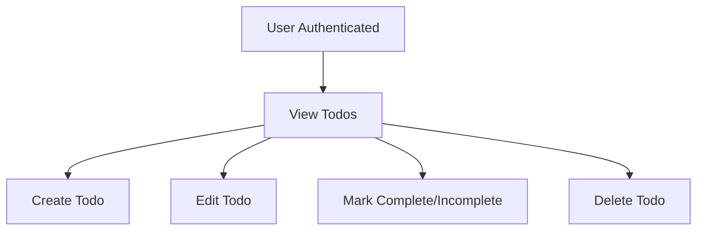

# Todo List Application - Requirements Analysis

## Service Overview
The Todo List application provides a streamlined digital service for users to efficiently record, browse, and manage their personal tasks. Its primary objective is to minimize cognitive overload by enabling clear and distraction-free planning, organization, and execution of daily activities. Only essential features for effective todo management are included. Success is measured by user reliability, stability of operation, and clarity of user experience.

- **Vision:** Empower all users to track and complete their tasks with minimal friction and maximum clarity.
- **Target Users:** Individuals seeking a lightweight, accessible tool for basic task management.
- **Essential Features:** Task creation, viewing list, marking complete/incomplete, editing, deletion.
- **Business Model:** Free, single-user service focused on practical value. No payments, ads, or data sales.
- **Success Metrics:** High user retention, user-completed task ratio, uptime, and user-reported satisfaction (survey/NPS).

## Problem Definition
WHEN task complexity or task load becomes unmanageable, THE user SHALL have a risk of missing obligations or deadlines.
WHEN users try to use complex project management tools for simple lists, THE user SHALL experience unnecessary cognitive burden and wasted time.
WHEN there is no fast, reliable way to record and view todos, THE user SHALL forget important tasks. This service bridges that gap by being fast, reliable, and intentionally minimal.

## Core Value Proposition
- WHEN a user needs to quickly capture and act on tasks, THE Todo List application SHALL provide an instant, distraction-free interface focused on core actions.
- WHEN a user checks their list, THE service SHALL display only necessary details to prevent overwhelm.
- WHEN the user completes or deletes a todo, THE service SHALL update immediately to promote satisfaction and trust.

## Service Operation Overview
User interaction always starts post-authentication. The major workflow is: user signs in (or registers), creates a todo, reads current/uncompleted todos, marks them done/undone, edits as needed, and deletes when unnecessary. There is no scheduling, reminders, sharing, or collaboration for MVP.

```mermaid
flowchart TD
  A["User Authenticated"] --> B["View Todos"]
  B --> C["Create Todo"]
  B --> D["Edit Todo"]
  B --> E["Mark Complete/Incomplete"]
  B --> F["Delete Todo"]
```

## User Actor Definition
- **Actor:** AuthenticatedUser - Any individual with a registered unique account (email/password or OAuth)
- **Permissions:**
  - Create todo
  - Read/list their own todos
  - Edit/update their own todos
  - Delete their own todos
  - Mark as complete/incomplete
- **Boundaries:** User has access only to their own data. No admin roles, no todo sharing, and no cross-user access.
- **Authentication:** WHEN a user registers, THE system SHALL require a valid email and password or third-party OAuth login. WHEN logged in, THE user SHALL create/manage todos. WHEN unauthenticated, THE user SHALL be unable to access any todo data.

## Primary User Scenarios
- WHEN the user is authenticated, THE system SHALL allow creating a new todo with a required title and optional description
- WHEN the user views their todo list, THE system SHALL display only their own todos, ordered by creation date, newest first
- WHEN the user marks a todo as complete/incomplete, THE system SHALL instantly update the todo status and reflect changes in the UI
- WHEN the user updates a todo, THE system SHALL persist the changes and display the updated todo item
- WHEN the user deletes a todo, THE system SHALL remove it from their list with no recovery

## Secondary Scenarios
- WHEN multiple todos have the same title, THE system SHALL treat them as separate items
- WHEN a user submits a blank title, THE system SHALL prevent saving/creating and indicate the need for a valid title
- WHEN a user tries to edit or delete a todo not owned by them, THE system SHALL refuse and show an error
- WHEN network connectivity fails during any operation, THE system SHALL indicate the error but keep the UI responsive
- WHEN the user toggles completion status rapidly, THE system SHALL quickly synchronize and reflect the latest state

## Error Handling
- WHEN a requested todo is not found (e.g., deleted by another client/device), THE system SHALL return a clear not-found message
- WHEN inputs are invalid (empty title, excessively long text), THE system SHALL show descriptive validation errors
- WHEN there are backend failures or timeouts, THE system SHALL display a retry option and avoid data loss
- WHEN authentication fails, THE system SHALL prevent all access and provide recovery (login/forgot password)

## Non-Functional Requirements
- WHEN operating under typical mobile/desktop usage, THE system SHALL handle 99.9% of actions in under 500ms
- WHEN traffic spikes by up to 10x normal, THE service SHALL continue basic operation (with degraded performance possible)
- WHEN data loss or corruption is detected, THE system SHALL attempt to restore from last good state
- Data SHALL be private to each user and protected using secure authentication and encrypted storage
- The service SHALL be available >=99.9% of the time (excluding planned maintenance)

## Business Rules and Constraints
- Each todo SHALL have a non-empty title (up to 140 characters) and optional description (up to 1,000 chars)
- Titles SHALL be unique only per item ID (duplicates allowed)
- Users SHALL only view or manage their own todos
- Todos SHALL be removed permanently upon deletion (no soft delete/undo)
- There SHALL be no prioritization, deadlines, tags, or attachments
- Data SHALL not be shared or visible to others
- Only minimal user information SHALL be stored for authentication; no analytics, profiling, or advertising
