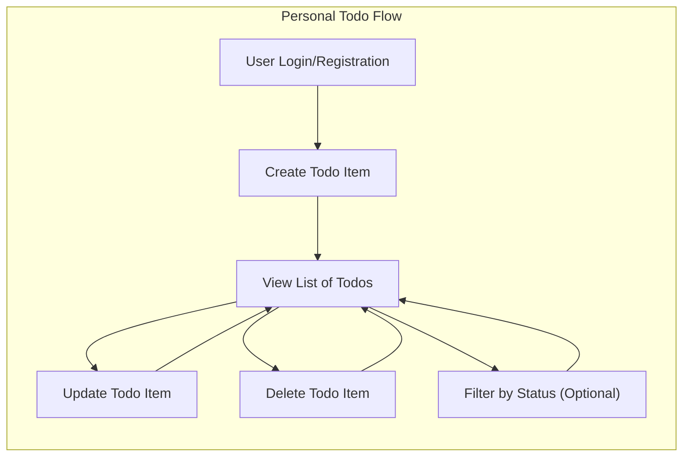

# Todo List Application Requirements Specification

## Vision Statement

Empower users to efficiently manage their daily tasks through a minimal, distraction-free interface, helping individuals be more productive and organized in all aspects of life. The system is designed to provide secure, private, and reliable task management with effortless user experience, maximizing usability for both technical and non-technical users.

## Target User Actors

### 1. User
- Any individual who creates a personal account via email and password authentication.
- Has private access to their own task list and is authorized to manage only items they own.
- No shared, group, or administrative roles are included in the minimum product; all users have the same permissions with respect to their own data.

## Essential Features & Functional Requirements

### EARS Format Requirements

- WHEN a user is not registered, THE system SHALL allow self-registration with a valid email address and sufficiently strong password.
- WHEN a user submits correct credentials, THE system SHALL authenticate the user, allowing secure session initiation.
- WHEN a user is authenticated, THE system SHALL allow the creation of a new todo item by specifying at least content text.
- WHEN a user is authenticated, THE system SHALL allow the display of a personal list of all their own todos, ordered chronologically (by creation or last update).
- WHEN a user is authenticated, THE system SHALL allow them to update the content or completion status of any todo they own.
- WHEN a user is authenticated, THE system SHALL allow deleting any of the user's own todos.
- THE system SHALL prevent users from accessing, viewing, or modifying todos owned by any other user.
- THE system SHALL record and persist the completion/incompletion status of each todo.
- WHEN a user marks a todo as complete, THE system SHALL keep it visible until the user deletes it.
- WHEN a user wishes, THE system SHALL enable filtering todo list by completion status (all, complete, incomplete).

### Error Handling Requirements (EARS)
- WHEN an unauthorized or unauthenticated access attempt occurs, THE system SHALL immediately return an error indicating authentication or permission denial.
- WHEN a user inputs invalid data (e.g., empty todo content, invalid email, weak password), THE system SHALL reject the action with a clear, actionable error message within 2 seconds.
- WHEN a requested todo does not exist or does not belong to the authenticated user, THE system SHALL return a not-found or forbidden error, never exposing other users' data.

## Business Rules & Supporting Logic

- Each user owns only their personal list; todo data is never shared.
- Each todo includes content (required) and completion status (default: incomplete).
- Only the owner may create, update, mark complete/incomplete, delete, or view their own todos.
- Data integrity must be maintained: actions on todos of other users are always rejected, and corresponding incidents are logged for audit.
- Sessions must be secure; session hijacking or data leakage between users is prohibited.
- Rate limiting and spam prevention measures should be defined for registration and todo creation endpoints to prevent abuse (e.g., no more than 5 registrations per IP per hour, or configurable limits).

## Business Processes & User Flows

### User Registration, Login, and Todo Management Flow

1. User accesses application and registers a new account with email/password.
   - Upon success, user is automatically logged in.
2. Authenticated user creates a todo by inputting text content (optionally specifying status as complete/incomplete at creation; otherwise, defaults to incomplete).
3. User views their entire todo list, with all items displayed in chronological order (recently updated/created first is recommended).
4. User can update the text or completion status of any of their own todos.
5. User may delete any of their own todos.
6. User can optionally filter todos by status: view all, only complete, or only incomplete.
7. User logs out, ending their secure session.

### Permission Model
- All authenticated users have identical permissions: full CRUD access over their own data only.
- Unauthorized or unauthenticated access to any endpoint SHALL be forbidden.

#### Explicit Permission Matrix:
| Feature                         | Unauthenticated | Authenticated-Owner |
|----------------------------------|-----------------|--------------------|
| Register account                 | ✓               | —                  |
| Login                           | ✓               | —                  |
| Create todo                      | —               | ✓                  |
| View own todo list               | —               | ✓                  |
| Update own todo                  | —               | ✓                  |
| Delete own todo                  | —               | ✓                  |
| Filter by status                 | —               | ✓                  |
| Access others' todo items        | ✗               | ✗                  |

#### Authentication Requirements
- Registration via email and password; password must meet complexity rules (minimum 8 characters, at least one number and letter).
- Login with email and password, returns secure JWT/session token.
- Only authenticated requests may access any todo-related functionality.
- All API actions must be scoped to the authenticated user.
- Logout must securely remove session/token.

## Visual User Flow Diagram

## Non-Functional and Performance Requirements
- The application SHALL respond to all user actions within 2 seconds under normal network and server load.
- All user data SHALL be stored securely and privately, with encryption at rest and in transit.
- System SHALL be available 99.5% of the time, excluding planned maintenance windows.
- THE system SHALL scale to at least 1,000 daily active users without performance degradation.
- All errors must be logged for monitoring, diagnosis, and improvement.
- All logged errors SHALL be anonymized (no personal or sensitive info stored in logs).

## Success Metrics

| Metric                | Description                                                             |
|-----------------------|-------------------------------------------------------------------------|
| Daily Active Users    | Number of unique users logging in and using the app per day              |
| User Retention Rate   | Percentage of users returning after 7 or 30 days                        |
| Task Completion Rate  | Ratio of completed tasks to total tasks created (measures engagement)    |
| Average Todos/User    | Average number of active todos per user (engagement/utility proxy)       |
| Time to First Todo    | Median time from login to first todo creation (lower indicates ease)     |
| Error/Support Rate    | Number of reported problems per DAU (target: minimal issues per user)    |

## Summary

The Todo List Application is engineered to maximize personal productivity for individuals by delivering core task management features only—personal todo CRUD, completion tracking, and secure user management—secured by strict privacy guarantees and minimalistic design. All requirements are specified in measurable, actionable terms, providing an unambiguous, production-ready blueprint for backend implementation.