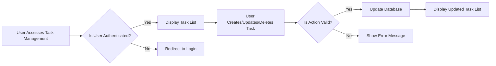

# Functional Requirements Document for Todo List Application

## User Stories

1. **Create New Tasks**: As a user, I want to create new tasks so that I can organize my work.
2. **View All Tasks**: As a user, I want to view all my tasks so that I can see what needs to be done.
3. **Update Tasks**: As a user, I want to update tasks so that I can correct or modify them.
4. **Delete Tasks**: As a user, I want to delete tasks so that I can remove completed or irrelevant tasks.
5. **Mark Tasks as Completed**: As a user, I want to mark tasks as completed so that I can track my progress.

## Task Management Requirements

1. **Create Task**: THE system SHALL allow users to create tasks with title and description.
   - WHEN a user submits a new task, THE system SHALL validate the input data.
   - IF the input data is valid, THEN THE system SHALL store the task in the database.

2. **Display Tasks**: THE system SHALL display all tasks with their status (completed/pending).
   - WHEN a user requests to view tasks, THE system SHALL retrieve tasks from the database.
   - THE system SHALL display tasks in a list with their status.

3. **Update Task**: THE system SHALL allow users to update task details.
   - WHEN a user updates a task, THE system SHALL validate the updated data.
   - IF the updated data is valid, THEN THE system SHALL update the task in the database.

4. **Delete Task**: THE system SHALL allow users to delete tasks.
   - WHEN a user deletes a task, THE system SHALL remove the task from the database.
   - THE system SHALL confirm the deletion to the user.

5. **Mark Task as Completed**: THE system SHALL allow users to mark tasks as completed.
   - WHEN a user marks a task as completed, THE system SHALL update the task status in the database.
   - THE system SHALL display the updated status to the user.

## User Interface Requirements

1. **Task List Display**: THE UI SHALL display a list of all tasks.
   - THE UI SHALL show task title, description, and status.

2. **Task Creation Form**: THE UI SHALL provide a form for creating new tasks.
   - THE form SHALL include fields for task title and description.

3. **Task Update Form**: THE UI SHALL provide a form for updating existing tasks.
   - THE form SHALL include fields for task title and description.
   - THE form SHALL be pre-populated with the current task details.

4. **Task Deletion Button**: THE UI SHALL include a button for deleting tasks.
   - WHEN a user clicks the delete button, THE system SHALL confirm the deletion.

5. **Task Completion Button**: THE UI SHALL include a button for marking tasks as completed.
   - WHEN a user clicks the completion button, THE system SHALL update the task status.
   - THE UI SHALL display the updated status to the user.

## EARS Format Requirements

All functional requirements are written in EARS format to ensure clarity and testability.

## Mermaid Diagram for Task Management Flow

