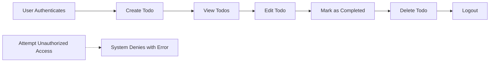

# Minimal Todo List Application Requirements

## 1. Problem Statement
Many users need a simple and reliable way to record, view, edit, and complete daily tasks. Complex or overloaded solutions burden users seeking only the basic experience. The Todo list service focuses on minimalism, eliminating friction, distraction, and unnecessary features while providing an effective solution to forgotten or scattered tasks.

## 2. User & Stakeholder Description
- **User**: Any authenticated individual who wants to manage their personal todo tasks simply and efficiently. No other roles exist in this minimal application.
- **Stakeholder**: Service owner, desiring high usability and minimal support needs due to reduced feature complexity.

## 3. Core Business Requirements (EARS Format)
- WHEN a user is authenticated, THE system SHALL allow creation of a new todo item with a text description.
- WHEN a user views their todo list, THE system SHALL display all of that user's current todo items in the order created.
- WHEN a user selects a todo item, THE system SHALL allow editing of the text description for only that user's item.
- WHEN a user marks a todo as completed, THE system SHALL visually indicate completion and update the list accordingly.
- WHEN a user deletes a todo item, THE system SHALL remove only the selected item from that user's list.
- IF a user attempts to access or modify another user's todo list or items, THEN THE system SHALL deny access and present a clear error message.
- WHEN a user signs out, THE system SHALL clear all access to their todos until re-authentication occurs.
- WHEN the user is not authenticated, THEN no access to any todo functionality SHALL be permitted (including viewing or creating todos).
- THE system SHALL not require any information from the user besides their preferred authentication identifier (e.g., email/password, or third-party SSO if enabled).

## 4. User Workflows and Business Processes
1. **Login/Authentication**: User logs in using minimal credentials. Access is only granted post-authentication.
2. **Create Todo**:
    - User enters a text description for a task.
    - User submits; system stores todo with current timestamp, visible only to that user.
3. **View Todos**:
    - User sees a list of active (not completed/deleted) todos in creation order.
4. **Edit Todo**:
    - User selects a todo from their list.
    - User edits text and saves; system updates that todo only.
5. **Mark as Completed**:
    - User marks a todo as completed.
    - Todo is visually indicated as completed, but remains visible unless deleted.
6. **Delete Todo**:
    - User chooses to delete a todo.
    - System permanently removes the item for that user only.

## 5. Error Handling and Edge Cases
- IF a user tries to submit a blank todo, THEN the system SHALL present a validation error and prevent add.
- IF a user attempts to edit or delete a non-existent or already-completed todo, THEN the action SHALL fail gracefully with feedback.
- WHEN network or server errors occur, THE system SHALL present an understandable, actionable failure message and never expose technical/internal details.
- IF two sessions attempt to modify the same todo, THE system SHALL prioritize the last submitted change and notify user if their action was not saved.

## 6. Access Control and Authentication
- All actions (create, view, update, delete, complete) REQUIRE user to be authenticated.
- Each user's todos are strictly private and isolated in storage.
- Direct access to any resource by user identifier outside authenticated session SHALL be denied.
- Only user-supplied credentials (email/password, or SSO if adopted) are accepted for login; no guest mode.
- Session management SHALL securely maintain authentication, with timeout and logout flows according to business policy.

## 7. Non-functional Requirements
- THE system SHALL store and retrieve todos reliably and persistently.
- Response time for all operations (create, update, delete, mark complete) SHALL be under 500ms in 95% of cases under normal load.
- Service SHALL be available 99.9% of the time in any rolling 30-day period.
- Data privacy and basic encryption at rest SHALL be enforced for all user data.
- THE user interface SHALL use clear, simple language.
- THE backend SHALL provide only minimal errors and avoid leaking information about internal state.

## 8. Success Metrics / Definition of Done
- Application is usable end-to-end by one or more users to manage todos with no prior training.
- All nine EARS requirements above are implemented and testable by QA and business owner.
- Unauthorized access attempts are both blocked and logged.
- All end-user error cases result in clear, actionable feedback.

## 9. User Scenarios & Examples

**Scenario 1: Creating a Todo**
- WHEN the authenticated user 'Alex' wants to remember "Call doctor",
- Alex logs in -> enters "Call doctor" in the add-todo field -> submits.
- THE system SHALL add "Call doctor" to Alex's todo list, visible only to Alex.

**Scenario 2: Editing and Completing a Todo**
- WHEN Alex realizes the description was wrong, Alex edits the todo to "Call dentist" and saves changes.
- Alex completes the todo; THE system SHALL strike-through or move it to completed section.

**Scenario 3: Error Condition (Unauthorized Access)**
- WHEN Alex tries to access todo of user Blake (different account), THE system SHALL deny access and alert Alex.

**Scenario 4: Error Condition (Blank Entry)**
- WHEN Alex tries to submit an empty todo, THE system SHALL prevent submission and display "Todo cannot be empty."

## 10. Appendix: Visual Workflow

---

This requirements analysis delivers the precise business logic and validation for a production-ready, minimal Todo list backend application. It is intentionally limited to essential functionality, eliminating all non-essential features and technical implementation details. All requirements are specific, testable, and suitable for handoff to development teams leveraging TypeScript, NestJS, and Prisma architectures.