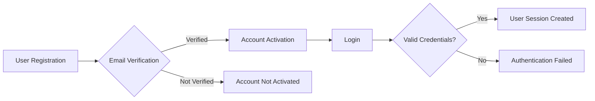

## User Authentication Requirements

## Overview
This document outlines the detailed requirements for user authentication in the Todo list application.

## Authentication Flow
The system SHALL authenticate users using email and password. The authentication flow SHALL include:
- User registration
- Email verification
- Login process

### User Registration
WHEN a new user attempts to register, THE system SHALL validate the email address. THE system SHALL send a verification email to the user's email address. WHEN the user verifies their email, THE system SHALL activate the account.

### Login Process
WHEN a user attempts to log in, THE system SHALL validate the credentials. IF the credentials are valid, THEN THE system SHALL create a user session. THE system SHALL return an authentication token upon successful login.

## Security Considerations
THE system SHALL store passwords securely using a suitable hashing algorithm. THE system SHALL protect against common authentication vulnerabilities such as brute-force attacks.

## Error Handling
IF authentication fails, THEN THE system SHALL return an appropriate error message. THE system SHALL limit the number of login attempts to prevent brute-force attacks.

## Mermaid Diagram
