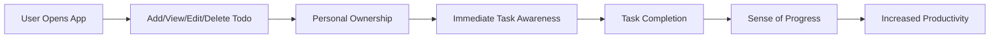

# Core Value Proposition for the Todo List Application

## Introduction
The Todo List Application provides a clear, distraction-free experience for individuals seeking efficient and reliable daily task management. Designed for users who want only the essential features, the app streamlines the process of capturing, viewing, updating, and completing personal tasks. The primary goal is to empower users to gain control over their daily obligations, enhance productivity, and eliminate the complexity found in feature-bloated productivity tools. The Todo List Application is tailored exclusively for single-user scenarios, focusing on privacy, simplicity, and robust data retention.

## Unique Benefits
- **Simplicity and Ease of Use**
  - WHEN a user accesses the application, THE system SHALL display a minimal interface dedicated to viewing and managing only that user's personal todo list.
  - WHEN a user wishes to create, update, or remove a todo item, THE system SHALL provide immediate, self-explanatory options with no unnecessary steps or features.
  - WHEN the user navigates the app, THE application SHALL avoid presenting non-core task management features or distracting elements.
- **Rapid Task Entry and Accessibility**
  - WHEN a user adds a task, THE application SHALL allow task creation in one clear action, with feedback confirming successful entry.
  - WHEN a user logs in or opens the app, THE system SHALL display all current, uncompleted tasks at a glance, without requiring extra clicks or searching.
  - WHEN a user searches for a todo, THE system SHALL instantly filter and present results matching the query.
- **Personal Data Ownership and Privacy**
  - THE system SHALL ensure that all tasks are private and accessible solely by the authenticated owner; unauthorized access by other users SHALL always be denied.
  - WHEN a user is not authenticated, THEN THE system SHALL prohibit all access to task operations and respond with an informative access error message.
  - WHEN an unauthenticated request is made, THE system SHALL require login before displaying or modifying any data.
- **Reliability and Consistent Operation**
  - THE system SHALL persist all user todos to ensure recovery from disruptions or outages, maintaining task integrity and preventing data loss.
  - IF a system error occurs during todo operations, THEN THE system SHALL notify the user clearly and provide actionable steps to retry or resolve the issue.
- **Minimal and Distraction-Free Experience**
  - THE application SHALL implement only the core todo management functions (create, read, update, delete), leaving out additional features such as reminders, collaboration, calendar integration, or notifications, unless business requirements formally include them.
  - WHILE the user interacts with their todo list, THE system SHALL maximize uninterrupted flow by minimizing visual clutter and system-generated interruptions.
  - WHERE features do not directly support the primary use case (personal todo management), THE system SHALL omit them to retain a pure focus on productivity.

### Mermaid Diagram: User Value Flow

## Key Differentiators
- **Genuine Minimalism**
  - THE system SHALL offer only the core mechanisms for adding, editing, viewing, and removing todos; advanced functions or settings SHALL be excluded unless directly required for basic personal task management.
  - WHEN features or configuration options do not contribute directly to completing personal todo tasks, THE system SHALL not include them.
- **Seamless Onboarding and Usability**
  - WHEN a new user first accesses the application, THE user SHALL be able to immediately understand how to use it, without onboarding tutorials or explanations, as all actions and navigation SHALL be self-evident.
- **Strictly Personal Scope**
  - THE application SHALL never display or share any part of a user's todo data with other users under any circumstances.
  - WHEN an attempt is made to access another user’s data, THEN THE application SHALL block the attempt and inform the initiator accordingly, without revealing any personal data.
- **Immediate Response and Feedback**
  - WHEN a user creates, updates, or deletes a todo item, THE system SHALL display updated task lists and relevant feedback instantly, confirming that actions were completed with no delay.
- **Robust Data Privacy and Security**
  - THE system SHALL avoid collecting or processing any personal data unrelated to task management, adhering to minimal data retention and privacy best practices at all times.
  - THE app SHALL perform regular background checks for data consistency and perform automatic recovery where possible, notifying the user only when manual intervention is required.

## User Motivations
- **Mental Clarity and Control**
  - Users want to move tasks from their mind to a secure place to avoid forgetting important responsibilities. WHEN a user thinks of a new task, THE system SHALL enable rapid, frictionless entry of the task into their personal list.
- **Confirmation of Progress and Accomplishment**
  - WHEN a user marks a todo as complete, THE system SHALL provide an immediate and visible acknowledgment of the accomplishment, promoting motivation and satisfaction.
- **Freedom From Complexity and Distractions**
  - Users desire a focused experience, so THE application SHALL not include non-essential workflows, social, or collaborative features. The design SHALL be free from advertisements, upsells, or non-core notifications.
- **Assurance of Data Security and Privacy**
  - WHEN a user interacts with their task list, THE application SHALL assure the user that all data is protected using industry-standard security practices, is never shared, and can only be accessed by the authenticated user.
- **Lifetime Data Continuity**
  - WHEN a user returns after a long absence, THE system SHALL guarantee that all uncompleted todos and completed task history are retained and visible, supporting an ongoing sense of progress and continuity.

### Table: User Motivations and System Guarantees
| User Motivation                         | System Guarantee (EARS)                                                              |
|-----------------------------------------|--------------------------------------------------------------------------------------|
| Reduce mental backlog                   | WHEN adding a task, THE system SHALL enable entry with a single clear action.         |
| Task visibility and prioritization      | WHEN accessing the app, THE system SHALL show all uncompleted todos up front.        |
| Sense of accomplishment                 | WHEN marking a todo complete, THE system SHALL display instant confirmation.          |
| Reduced frustration from errors         | IF any error occurs, THEN THE system SHALL display a recoverable, actionable message. |
| Confidence in privacy and data safety   | THE system SHALL enforce access controls so that only the owner can view or alter tasks.|
| Seamless service continuity             | WHEN returning after absence, THE system SHALL display the up-to-date task list.      |

## Summary
The Todo List Application stands apart by providing a genuinely minimal, single-user experience that is private, reliable, and distraction free. All features are intentionally limited to support the core task management workflow: adding, viewing, updating, and completing todos efficiently. Every interaction, message, and function is designed with clarity, privacy, and performance as the sole priorities—making the app the ideal choice for users who value simplicity, control, and productivity with zero digital clutter. The system’s robust privacy, clear feedback, and unyielding focus on core needs ensure that users can trust the Todo List Application as their daily productivity companion.