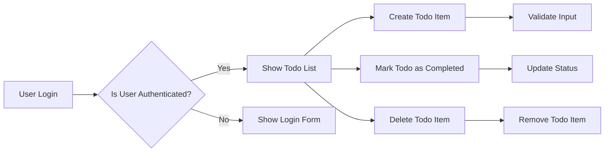

## Service Overview

The Todo list application is designed to help users manage their daily tasks efficiently. It allows users to create, view, mark as completed, and delete Todo items. The application is free to use with potential for premium features or ad-supported model.

### Business Model

The application is aimed at individuals looking for a straightforward task management solution. It will be available for free, with potential for future monetization through premium features or advertisements.

### User Roles

1. User: Authenticated user who can manage their Todo lists

### Functional Requirements

1. Create Todo Item
   - WHEN a user submits a new Todo item, THE system SHALL create it with a unique ID.
   - THE Todo item SHALL have a title and optional description.

2. Read Todo Items
   - THE system SHALL display all Todo items for the authenticated user.
   - WHEN a user requests to view Todo items, THE system SHALL return them in a list.

3. Update Todo Item Status
   - WHEN a user marks a Todo item as completed, THE system SHALL update its status.
   - IF a user tries to mark a non-existent Todo item as completed, THEN THE system SHALL return an error.

4. Delete Todo Item
   - WHEN a user deletes a Todo item, THE system SHALL remove it from the list.
   - IF a user tries to delete a non-existent Todo item, THEN THE system SHALL return an error.

### Non-functional Requirements

1. Performance
   - THE system SHALL respond to user actions within 2 seconds.
   - WHILE handling multiple user requests, THE system SHALL maintain performance.

2. Security
   - THE system SHALL authenticate users before allowing access to their Todo lists.
   - WHEN a user logs in, THE system SHALL validate their credentials.

### User Scenarios

1. User creates a new Todo item:
   - User logs in
   - User clicks 'Create Todo'
   - User enters title and optional description
   - System creates and displays the new Todo item

2. User marks a Todo item as completed:
   - User views their Todo list
   - User clicks 'Complete' on a Todo item
   - System updates the Todo item status
   - System displays the updated list

### Mermaid Diagram
