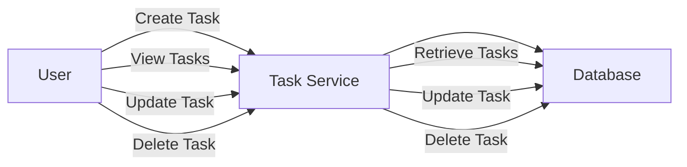

# Todo List Application Requirements

## Overview
The Todo list application will allow users to manage their tasks efficiently. The core functionality will include creating, reading, updating, and deleting (CRUD) tasks.

## Functional Requirements

1. **Task Management**
   - Users can create new tasks with a title and description.
   - Users can view all tasks.
   - Users can update the title and description of existing tasks.
   - Users can delete tasks.
   - Users can mark tasks as completed.

2. **Task Attributes**
   - Each task will have the following attributes:
     - `id` (unique identifier)
     - `title`
     - `description`
     - `completed` (boolean indicating whether the task is completed)
     - `created_at` (timestamp when the task was created)
     - `updated_at` (timestamp when the task was last updated)

## Non-Functional Requirements

1. **Performance Expectations**
   - The application shall respond to user interactions within 2 seconds.
   - The system shall support at least 100 concurrent users without degradation in performance.
   - The application shall optimize database queries to minimize resource usage.

2. **Security Requirements**
   - All user data shall be encrypted both in transit and at rest using industry-standard encryption protocols.
   - The application shall implement secure authentication mechanisms.
   - Access to user data shall be restricted based on user roles and permissions.

## Technical Requirements

1. **Backend Technology**
   - The backend will be built using TypeScript and NestJS framework.
   - The database will be managed using Prisma.

2. **API Design**
   - The application will expose RESTful APIs for task management.
   - API endpoints will be designed to support CRUD operations on tasks.

## Implementation Details

1. **Task Creation**
   - WHEN a user creates a new task, THE system SHALL validate the task title and description.
   - THE system SHALL store the task in the database with a unique identifier.

2. **Task Retrieval**
   - WHEN a user requests to view tasks, THE system SHALL retrieve all tasks from the database.
   - THE system SHALL display the tasks with their status (completed or pending).

3. **Task Update**
   - WHEN a user updates a task, THE system SHALL validate the new title and description.
   - THE system SHALL update the task in the database and record the update timestamp.

4. **Task Deletion**
   - WHEN a user deletes a task, THE system SHALL remove the task from the database.
   - THE system SHALL confirm the deletion to the user.

## Mermaid Diagram for Task Management Workflow

```mermaid
graph LR
    A["User"] -->|"Create Task"| B["Task Service"]
    B --> C["Database"]
    A -->|"View Tasks"| B
    B -->|"Retrieve Tasks"| C
    A -->|"Update Task"| B
    B -->|"Update Task"| C
    A -->|"Delete Task"| B
    B -->|"Delete Task"| C
```

## Conclusion
The Todo list application will be built with a focus on performance, security, and usability. The backend will be developed using TypeScript and NestJS, with Prisma managing the database. The application will expose RESTful APIs to support task management operations.