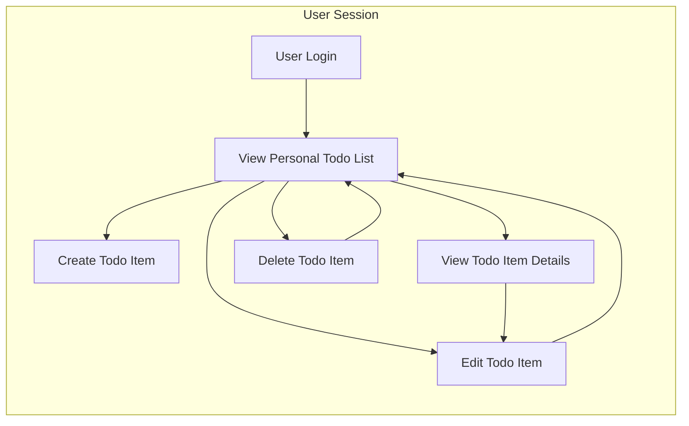

# Todo List Application Minimum Requirement Analysis

## Purpose
Provides detailed, implementation-ready business requirements for the minimal Todo list application. Requirements define user interactions, process flows, permission boundaries, and all critical user/system expectations.

## Service and User Boundaries
- Every function and data record is scoped strictly to the authenticated user session.
- There is no support for shared or collaborative tasks. All actions affect only the logged-in user's own collection of todos.
- No access to any data outside the authenticated session; user privacy is absolute.

## Primary Processes

### 1. User Authentication (Precondition)
- WHEN a user accesses the service, THE system SHALL require authentication before displaying, creating, editing, or deleting any todo item.
- IF the session is expired or invalid, THE system SHALL redirect to login and withhold all todo data.

### 2. Todo Creation
- WHEN a user submits a new todo with a non-empty title (description and metadata optional), THE system SHALL add it to their personal list linked to the current session.
- IF required fields are missing (at least title), THEN THE system SHALL deny creation and provide a clear error message.
- WHEN a todo is created successfully, THE system SHALL return immediate visual confirmation.

### 3. Todo List Viewing
- WHEN authenticated, THE user SHALL see a live-updated list of all their own todo items, including completed and uncompleted ones.
- THE system SHALL allow filtering, sorting, and searching todos by status, creation date, or due date.
- WHEN a user requests only completed or only uncompleted todos, THE system SHALL respond with the correct filtered list.

### 4. Todo Detail Viewing
- WHEN a user selects a todo from the list, THE system SHALL display all associated details including metadata if present.
- IF a user tries to view a todo not belonging to them, THEN THE system SHALL refuse the request and display an error.

### 5. Todo Update
- WHEN a user edits any field of their existing todo and submits changes, THE system SHALL validate input and update the todo.
- IF the updated title is empty, THEN THE system SHALL reject the update and prompt for valid data.
- WHEN a user marks a todo as completed, THE system SHALL move it out of the "active" list and reflect this state across the UI.
- WHEN a completed todo is re-opened (marked incomplete), THE system SHALL restore it to the active list.

### 6. Todo Deletion
- WHEN a user requests to delete their todo, THE system SHALL remove it from their list permanently and confirm deletion.
- IF the user tries to delete a todo not owned by them, THEN THE system SHALL return an explicit access-denied error.

## Permission Matrix (Business View)
| Operation         | User Can Affect      | Requires Auth? |
|-------------------|---------------------|----------------|
| Create Todo       | Own todos only      | Yes            |
| View Todos/Detail | Own todos only      | Yes            |
| Edit/Update Todo  | Own todos only      | Yes            |
| Mark Complete     | Own todos only      | Yes            |
| Delete Todo       | Own todos only      | Yes            |

- UNDER NO CIRCUMSTANCE shall a user EVER access or affect another user's data.
- ALL todo actions require prior authentication; no part of the system is anonymous or public.

## Business Workflow (Visual)

## Business Rules: EARS Requirements
- WHEN a user is authenticated, THE system SHALL enable access exclusively to that user's own data; all operations are identity-scoped.
- WHEN creating a todo, THE system SHALL require a non-empty title and accept optional fields (description, due date, etc).
- IF creation or update is attempted with missing/invalid required data, THEN THE system SHALL reject the operation and explain why.
- WHEN listing todos, THE system SHALL provide user-controllable sorting and filtering options based on status/dates.
- WHEN completion status changes, THE system SHALL instantly update state across the user interface.
- WHEN deletion is confirmed, THE system SHALL IRREVERSIBLY remove the todo from the authenticated user's records and signal completion.
- IF any attempt is made to view, edit, or delete an item not owned by the current user, THEN THE system SHALL block the action and provide an explicit explanation.
- WHILE the user's session is not authenticated, THE system SHALL NOT display or accept any todo-related information or changes.
- WHERE allowed, bulk operations SHALL always apply only to items selected by the authenticated user and never cross into other users' data.

## Exclusions & Non-Requirements
- No collaborative tasks or shared lists.
- No role management or admin features.
- No labels, reminders, notifications, recurring todos, or advanced categorization.
- No API, schema, or UI specifications—only business requirements are in scope.

## Non-Functional Constraints (as business impact)
- Operation speed for all list/change actions SHALL be near-instantaneous to support user productivity.
- Private user data SHALL NOT be accessible to third parties under any conditions.
- System SHALL clearly communicate all errors and required user actions.
- The business rules defined herein constitute the entirety of the MVP functional expectation.

---

This document is the sole authoritative specification for the MVP Todo List backend's business logic and requirements.