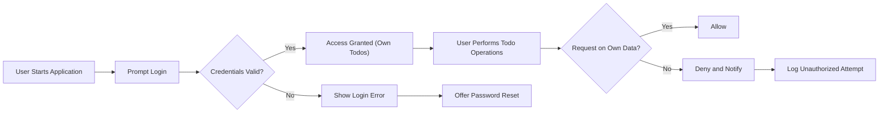

# Todo List Application – Comprehensive Requirements

## 1. User Actors

The Todo List application supports a single actor: the **User**. This is any individual who wishes to track, manage, and organize their personal tasks digitally through a secure, privacy-first, and intuitive application interface.

### Actor Description
Users are authenticated individuals responsible for managing only their own todo items. Users expect a private, personally-owned task management experience. There is no concept of group or shared todo management in this minimal application.

## 2. Core Business Requirements (EARS Format)

- WHEN a user wants to use the Todo List app, THE system SHALL require login via a recognized authentication method such as email and password.
- WHEN a user signs up, THE system SHALL create a new, isolated user profile strictly for their own todo items.
- WHILE authenticated, THE user SHALL be able to create new todos with a title (required), description (optional), and status (completed/not completed).
- THE user SHALL be able to view a full list of their own todos at any time after signing in.
- WHEN selecting a specific todo, THE user SHALL be able to view all details for their own todo items only.
- WHEN editing, THE user SHALL be able to update the title, description, or completion status of their own todo items at any time.
- WHEN deleting, THE user SHALL be able to permanently remove any of their own todo items from their list.
- THE system SHALL NOT allow users to access, modify, or view todo items belonging to any other user under any circumstance.
- IF invalid credentials are supplied at login, THEN THE system SHALL prevent access and provide a clear, non-technical error message.
- WHEN authentication credentials are lost or forgotten, THE system SHALL provide a password reset flow that is both secure and simple.

## 3. Permissions and Access Matrix

| Action                     | User |
|----------------------------|------|
| Create new todo            | ✅   |
| View all own todos         | ✅   |
| View other users' todos    | ❌   |
| Update own todos           | ✅   |
| Delete own todos           | ✅   |
| Update others’ todos       | ❌   |
| Delete others’ todos       | ❌   |
| Bulk actions (e.g., mass delete or mass update) | ❌   |

#### Key Permission Principles
- Access is always restricted to the authenticated user’s own data.
- Any attempt to access another user’s data SHALL be denied with a business-level error response.

## 4. Authentication and Session Management
- WHEN a user accesses the app, THE system SHALL prompt for credentials and validate them securely.
- WHEN authentication is successful, THE user SHALL gain access to only their todos and related operations.
- IF authentication fails, THEN THE user SHALL see an understandable error and be prompted to retry.
- WHILE session is active, all actions are restricted to the current user and scoped to their account only.
- WHEN a session expires due to inactivity or logout, THE system SHALL require re-authentication before permitting access to user data.
- User registration and password reset flows SHALL balance business logic clarity and user security, with clear feedback and secure transmission of credentials.

### Authentication and Access Control Diagram

## 5. Business Rules & Constraints
- There is only one actor type – the user. No administrators or privileged roles are present.
- All todo actions (create, view, update, delete) apply only to the authenticated user’s personal todo list.
- The system SHALL never expose any user’s data or identity to another user.
- WHERE repeated failed logins occur, THE system SHALL temporarily block further attempts and prompt the user for recovery options.
- Titles are required for todos; descriptions are optional and may be empty.

## 6. Error and Recovery Scenarios (EARS Format)
- IF a user tries to access or modify another user’s todos (e.g., by manipulating URLs or request data), THEN THE system SHALL deny the action and state "Access denied. You cannot manage tasks that are not yours."
- IF a user session is inactive for a set security interval, THEN THE system SHALL log out the user and require login again.
- IF authentication credentials are lost, THE system SHALL guide the user through a password reset process with clear business-language steps.
- WHEN any system error (server, network, or database failure) prevents todo operations, THE system SHALL display a plain-language explanation, hide technical details, and suggest retry or support steps.

## 7. Summary

The Todo List application provides each user with a secure, strictly private, and business-compliant digital environment for managing personal tasks. All functionality is intentionally limited to the basics required for todo management: create, read, update, and delete own tasks, with no multi-user collaboration. Privacy, access control, and error feedback are enforced according to the above business rules. The user experience and backend contract are fully specified here for frictionless implementation and reliable business operation.