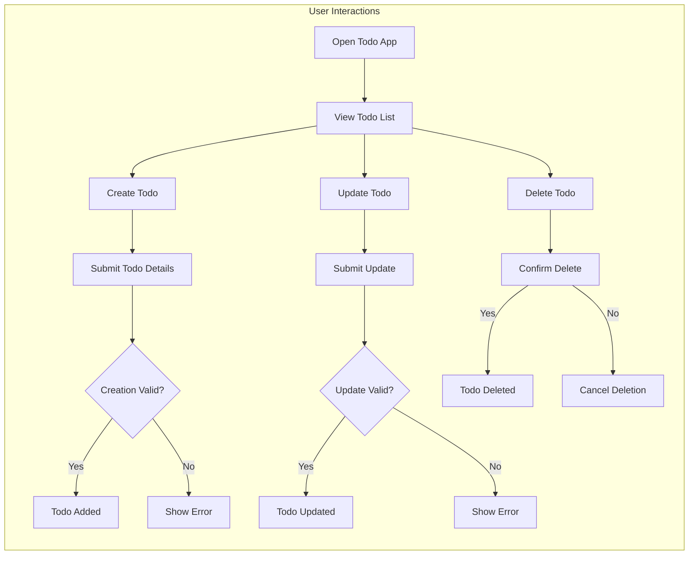

# Todo List Application: Requirements Analysis Report

## Introduction & Purpose

The Todo List application provides an efficient, minimal set of features to help users manage personal tasks. This requirements analysis ensures that the business context, user experience, and operational rules for a production-grade todo management service are clear and actionable for backend implementation. The application targets users seeking to add, review, update, and remove tasks, focusing on usability, reliability, and clarity of workflows. The requirements use the EARS methodology for absolute clarity and testability.

## Supported User Actor(s)

- **user:** A registered, authenticated individual who manages their own todo list. Each interaction presumes proper authentication and authorization, ensuring privacy and data isolation between users.

## Primary User Scenarios & Business Requirements

### 1. Create Todo

- WHEN a user initiates the creation of a todo item, THE system SHALL provide an intuitive interface to enter todo details.
- THE system SHALL require a non-empty 'description' (max. 255 characters) for each todo item.
- WHERE a user includes a due date, THE system SHALL require the date to be a valid day (YYYY-MM-DD) and not past when entered.
- WHERE a user includes a priority, THE system SHALL limit it to 'low', 'medium', or 'high'.
- WHEN the user submits valid details, THE system SHALL create the todo and assign it directly to the authenticated user.
- IF required fields are omitted or validation fails (description missing/too long, date in past, or invalid priority), THEN THE system SHALL prevent creation and provide a clear error.
- DUPLICATE todos are allowed only if at least one field (description/due date/priority) differs for the same user.

### 2. View Todos

- WHEN a user requests to view their todos, THE system SHALL present all of their current and historical todo items.
- THE system SHALL display for each todo: ID, description, status (pending/completed), creation time, due date (if set), priority (if set), and last updated date.
- THE system SHALL provide filtering by completion status, due date, and priority.
- WHERE filter/sort is requested, THE system SHALL apply user preferences and present filtered/sorted results.
- IF no todos exist for a user, THEN THE system SHALL clearly communicate an empty-state message.
- IF a filter/sort parameter is invalid, THEN THE system SHALL return an error and not complete the operation.
- Users MAY NOT see todos belonging to other users under any scenario.

### 3. Update Todo

- WHEN a user chooses to update a todo, THE system SHALL enable modification of description (max. 255 characters), due date (if not in the past), priority, and completion status.
- COMPLETED status can only be true or false. WHERE marked complete, THE system SHALL store completion timestamp.
- IF the user attempts to update a todo belonging to another user or a non-existent todo, THEN THE system SHALL deny access and give a clear error response.
- IF the updated description, date, or priority fails validation, THEN THE system SHALL block and explain the error.
- UPDATE actions are restricted to the authenticated owner of each todo.

### 4. Delete Todo

- WHEN a user initiates deletion of a todo, THE system SHALL require explicit confirmation (e.g., prompt or double action).
- IF the todo does not exist or isn't owned by the user, THEN THE system SHALL refuse and provide an error.
- WHERE user confirms, THE system SHALL permanently delete the todo and remove it from all future responses.
- IF deletion is successful, THE system SHALL acknowledge completion clearly. IF cancelled, no change is made.
- DELETED todos are not recoverable via standard user flows, ensuring intentional data removal and privacy.

## Mermaid Workflow Diagram

## Summary

The Todo List application is designed to provide only the essential features required for effective personal task management. All functional scenarios—creation, viewing, updating, and deletion—are modeled with clear EARS-compliant requirements. Business rules ensure data privacy, robust error handling, and a smooth, minimal user experience. All processes, permissions, and error conditions are articulated in natural language for unambiguous backend development and validation. No technical or API/database implementation details are included, ensuring this document is a pure business requirements specification ready for production backend engineering.