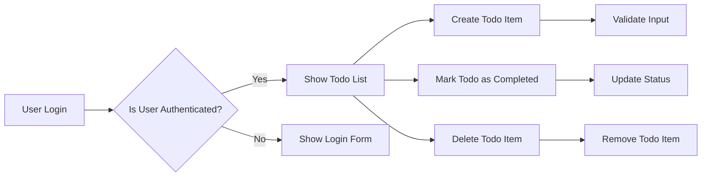

# Todo List Application Requirements

## Service Overview
The Todo list application is designed to help users manage their daily tasks efficiently. It allows users to create, view, mark as completed, and delete Todo items. The application is aimed at individuals looking for a simple task management solution.

### Business Model
The application is free to use with potential for future premium features or ad-supported model. It supports a single user role: 'user', who can manage their own Todo lists.

## User Roles and Permissions
- **User**: Authenticated users who can create, view, update, and delete their Todo items.

## Functional Requirements
1. **Create Todo Item**: WHEN a user submits a new Todo item, THE system SHALL create it with a unique ID.
2. **Read Todo Items": THE system SHALL display all Todo items for the authenticated user.
3. **Update Todo Item Status**: WHEN a user marks a Todo item as completed, THE system SHALL update its status.
4. **Delete Todo Item**: WHEN a user deletes a Todo item, THE system SHALL remove it from the list.

## Non-functional Requirements
1. **Performance**: THE system SHALL respond to user actions within 2 seconds.
2. **Security": THE system SHALL authenticate users before allowing access to their Todo lists.

## Success Metrics
- **User Engagement**: Measure frequency and duration of user interactions.
- **Performance Metrics**: Track response times and error rates.

## Error Handling
THE system SHALL handle errors gracefully, providing clear error messages. Common error scenarios include authentication failures, input validation errors, and data access issues.

## Data Model
THE system SHALL store Todo items with the following attributes:
- **id**: Unique identifier for the Todo item
- **content**: Text content of the Todo item
- **completed**: Boolean indicating whether the Todo item is completed
- **userId**: Identifier of the user who owns the Todo item

## Authentication Requirements
- **Token Type**: JWT (JSON Web Tokens)
- **Access Token Expiration**: 15 minutes
- **Refresh Token Expiration**: 7 days
- **JWT Payload**: Contains user ID, role, and permissions array

