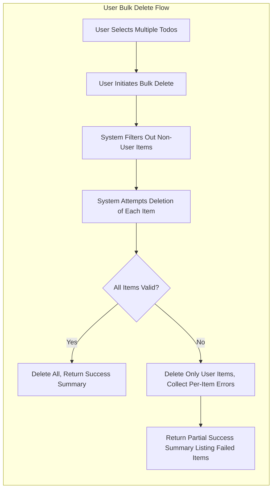
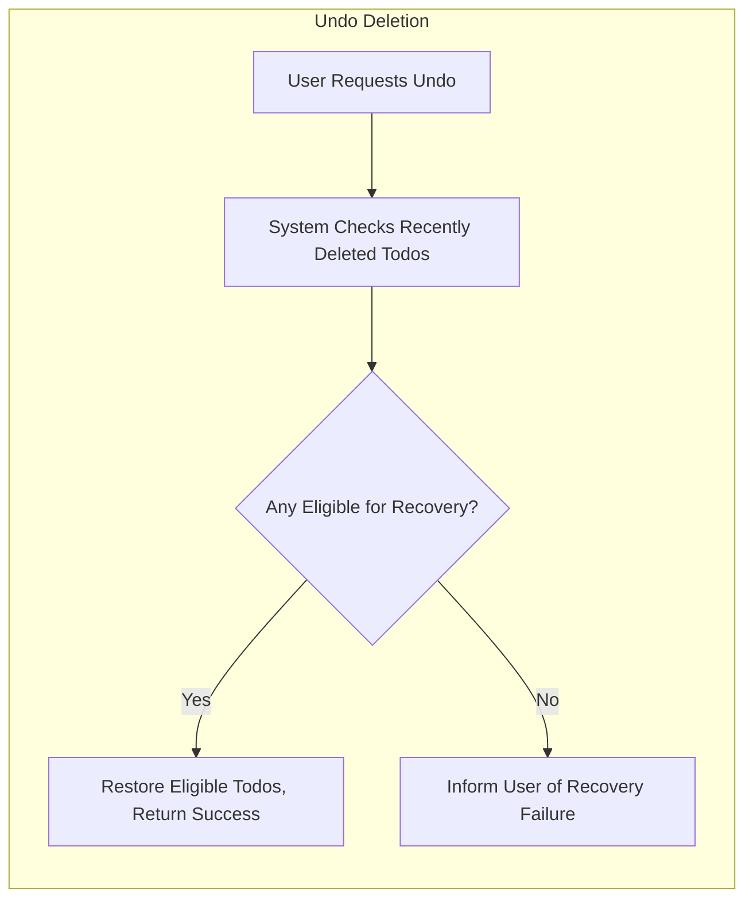
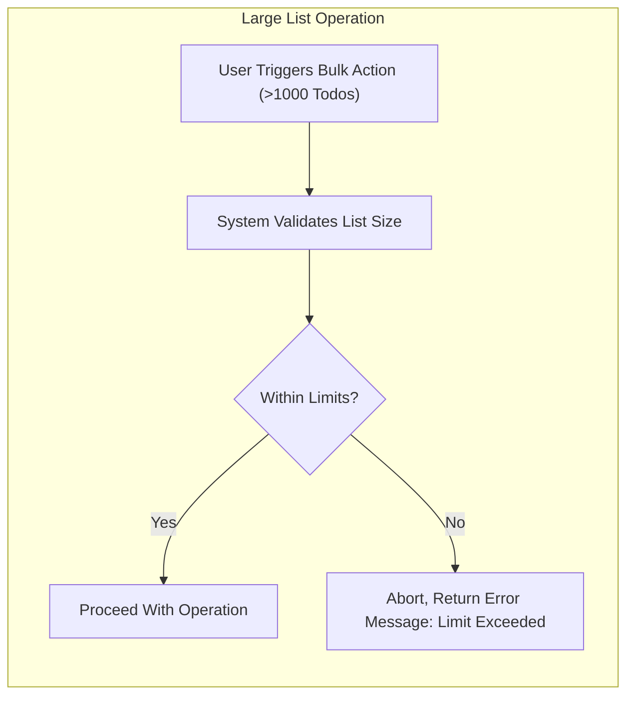

# Secondary and Edge-Case Requirements for Todo List Application

## Introduction
Robust Todo list applications address not only the main workflows of adding, viewing, editing, and deleting individual items but also all secondary and edge scenarios. This encompasses batch (bulk) operations, marking completion/incompletion, reversing actions, and handling rare or error conditions for reliable, user-friendly operation. This document formalizes every such scenario using precise EARS (Easy Approach to Requirements Syntax) requirements, with actionable, natural language core content for backend developers.

## Bulk Operations
Efficient todo management requires the ability to perform operations on multiple items at once.

### Bulk Creation
- WHEN a user submits a request containing multiple todos for creation, THE system SHALL create each valid todo, return success/failure status for each, and provide details describing any errors for invalid todos.
- IF any todo item in the request is invalid (missing required fields, business rule violation), THEN THE system SHALL create only valid items and enumerate specific errors for each failed item in the response.
- WHERE batch creation is processed, THE system SHALL preserve the order of items supplied by the user unless technical/business rules require reordering (e.g., for prioritization).

### Bulk Modification
- WHEN a user initiates an update to multiple existing todos (change due date, label, priority, etc.), THE system SHALL attempt to update all requested items that the user owns, providing per-item success and error results.
- IF a todo item in the batch is invalid or not owned by the user, THEN THE system SHALL skip update for that item and include the explicit reason in the response.
- WHERE all batch modifications succeed, THE system SHALL confirm the total number of updated items and details per item.

### Bulk Deletion
- WHEN a user selects multiple todos to delete in a single action, THE system SHALL only delete todos owned by the user and must enumerate deleted, skipped, and failed items in a clear summary for the user.
- IF a todo is not found or already deleted, THEN THE system SHALL list it as "not found" but process all others.
- WHERE deletion is an irreversible operation, THE system SHALL always require explicit user confirmation for batch deletion.

## Completion Toggling and Undo Flows
The system supports both toggling completion status (complete/incomplete) and undoing previous actions. All requirements apply to individual or batch operations.

### Mark Complete/Incomplete
- WHEN a user marks one or more todos as complete, THE system SHALL set their completion status and record the exact completion timestamp.
- WHERE a todo was already complete, THE system SHALL make no change and indicate this in the operation summary.
- WHEN a user marks a completed todo as incomplete, THE system SHALL return it to active state and clear the completion timestamp.
- IF the user attempts to toggle a deleted todo, THEN THE system SHALL return a clear, non-technical error message stating that the action is not possible.

### Undo Deletion
- WHEN a user requests undo after a recent deletion, THE system SHALL restore todos deleted by that user, provided permanent purge has not occurred.
- WHERE permanent deletion was finalized, THE system SHALL inform the user which items cannot be recovered and why.
- THE system SHALL restrict undo operations to actions performed by the requesting user and only within a defined time window (e.g., 5 minutes).

### Undo Edits
- WHEN a user requests to undo edits to a todo or a batch of todos, THE system SHALL revert targeted items to the immediately previous state, using reliable item versioning.
- WHERE undo is performed on batch edits, THE system SHALL roll back all items affected by the batch using the respective previous versions and record all reversions in the todo history/audit log.

## Exceptional and Rare Flows
These requirements address situations occurring infrequently or representing boundary input/processing cases.

### No Todos Found
- WHEN a user requests todos and has none, THE system SHALL return an empty list with a success status (not an error), optionally with a motivational message.

### Already-Completed/Deleted Operations
- IF a batch operation targets todos that are already complete or deleted, THEN THE system SHALL skip those items, returning a summary with explicit status and reasons for each.
- WHERE a todo not owned by the current user is included in any batch, THE system SHALL neither process nor reveal details about the item other than that it was unauthorized.

### Handling Large Lists
- WHEN a user performs any action (view, modify, delete, batch update) on a very large todo list (e.g., more than 1000 items), THE system SHALL enforce resource, performance, and time limits, informing the user if the limit is exceeded and suggesting pagination or batch constraints.
- WHERE an operation fails due to system limits (timeout, memory), THE system SHALL abort the action safely and return a descriptive, actionable error message.

### Batch Failure/Error Handling & Atomicity
- WHEN a bulk operation processes a mix of valid and invalid todos, THE system SHALL process valid items, skip or error on invalid, and return granular, per-item results – unless the user requests atomicity ("all succeed or none").
- WHERE atomicity is explicitly requested, THE system SHALL guarantee all-or-nothing behavior: IF any item fails, THEN THE system SHALL roll back the entire batch and communicate the cause.
- WHERE atomicity is not specified, THERE SHALL be no rollback for partial failures.

## Permissions and Security for Edge Cases
- THE user SHALL only be permitted to perform bulk, undo, and exceptional scenario actions on todos they own.
- WHERE an item in a batch is not owned by the requesting user, THE system SHALL skip it, deny access, and avoid exposing any information (title, content, completion status).
- THE system SHALL ensure all batch or undo actions are subject to the same strict authentication and access control as regular CRUD operations.
- THE system SHALL never leak any information about the existence, title, or status of todos not owned by the user.

## Validation and Business Rules for Secondary Scenarios
- THE system SHALL enforce all individual item-level validation (required fields, business rules, due date) for each todo in a batch operation or undo scenario.
- WHEN a batch input contains items missing required information, THE system SHALL process only valid items and enumerate reasons for others' exclusion.
- WHERE data conflicts arise (e.g., concurrent modification, version mismatch), THE system SHALL apply optimistic concurrency control and report the conflict status per-item in results.

## Mermaid Diagrams for Edge and Batch Flows

### Bulk Deletion & Partial Error Handling

### Undo Deletion/Recovery Flow

### Handling Extremely Large Operations

## Summary and Success Criteria
All secondary, edge-case, batch, undo, exceptional, and rare scenario requirements here MUST be implemented with full test coverage. Backend teams SHALL use this document as definitive guidance for robust, predictable, user-centric, and secure handling of anything outside the standard todo operations. Requirements here are specific, measurable, and suitable for immediate development and testing without ambiguity.