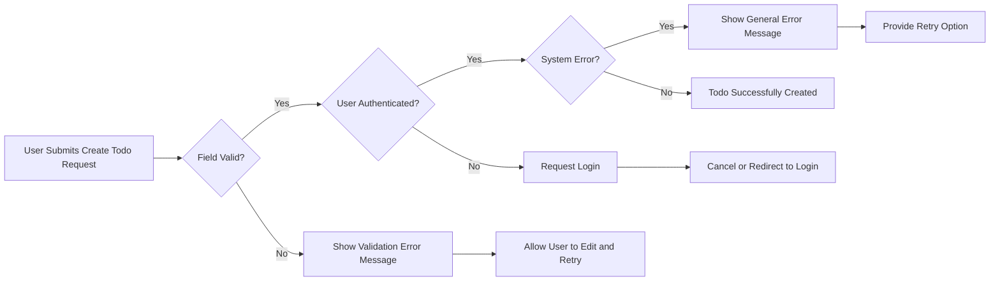
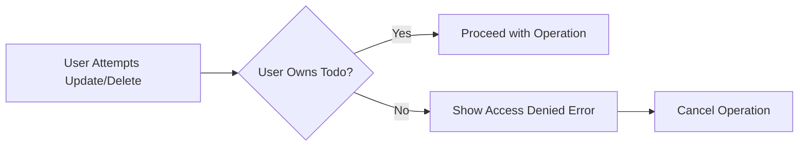
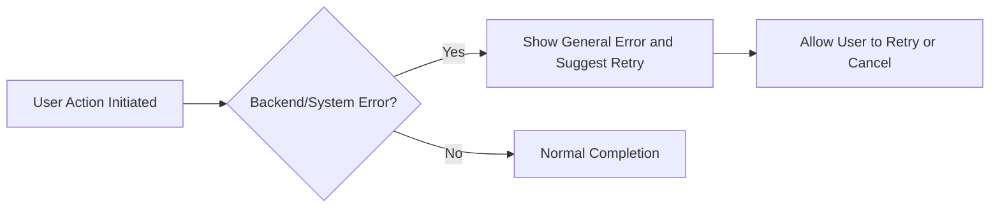

# Requirement Analysis for Minimum Todo List Application

## Introduction
The Todo List application serves as a simple and focused tool to help users track tasks by offering only the minimum necessary features. This document details the business requirements, user interactions, constraints, and critical workflows necessary for backend implementation, ensuring all processes are defined in unambiguous business language and EARS format where applicable. No extra features beyond basic todo management shall be included at this stage.

## Actors
- **User**: Any person who registers/logs in to manage their own todo items. They can create, read, update, and delete only their own todos. There are no administrative roles or shared todo management in this minimum version.

## Business Requirements

### Core Functional Requirements
- WHEN a user is authenticated, THE system SHALL permit the user to create a todo by specifying a title (required), and optionally a description and due date.
- WHEN a user requests to view todos, THE system SHALL return a list of all todos belonging only to that user, ordered by creation time.
- WHEN a user updates a todo, THE system SHALL permit updating the title, description, or due date IF AND ONLY IF the user owns that todo.
- WHEN a user deletes a todo, THE system SHALL permanently remove the todo IF AND ONLY IF the user owns it.
- WHEN a user is not authenticated, THEN THE system SHALL deny any attempt to create, update, or delete todos and present an authentication-required message.
- The minimum fields required for a todo are: title (string, not empty, max 200 chars).
- THERE SHALL BE NO feature for sharing, assigning, bulk operations, or priorities in this minimum application version.

### Authentication and Authorization
- WHEN a user registers or logs in successfully, THE system SHALL establish an authenticated session for that user.
- WHEN a user attempts a write operation on any todo (create, update, delete), THE system SHALL check authentication and ownership.
- WHEN a user operates on a todo they do not own, THE system SHALL reject the operation and provide a clear error ("Forbidden: This todo does not belong to you.").
- WHEN an unauthenticated session token is presented, THE system SHALL reject requests and require the user to log in.

### Error Handling Requirements
See 'Error Scenarios and Recovery' and EARS Table below for detailed error management scenarios.

## User Scenarios

### Scenario 1: Creating a Todo
- WHEN an authenticated user submits a valid title, THE system SHALL create the todo and confirm success.
- WHEN the title is missing or empty, THE system SHALL reject the request and specify the field is required.

### Scenario 2: Viewing Todos
- WHEN a user requests to view todos, THE system SHALL list only their own todos.

### Scenario 3: Updating a Todo
- WHEN a user attempts to update their own todo with valid information, THE system SHALL process the update and confirm.
- WHEN the user tries to update a todo not belonging to them, THE system SHALL reject and show an access denied message.
- WHEN the new title is invalid, THE system SHALL reject and specify the validation error.

### Scenario 4: Deleting a Todo
- WHEN a user requests to delete a todo owned by them, THE system SHALL delete it and confirm removal.
- WHEN the user tries to delete a todo not theirs, THE system SHALL deny and present an error.

### Scenario 5: Error and Edge Cases
- WHEN an unauthenticated or expired session requests an operation, THE system SHALL require login.
- IF the user repeatedly submits the same create request, THEN THE system SHALL prevent duplicate todos if applicable and inform the user (optional for minimum version).
- IF the backend/database is unavailable, THEN THE system SHALL return a general error and advise to retry later.

## Business Rules and Constraints
- Each user may only manage their own todos; cross-user access is strictly forbidden.
- Title is mandatory for every todo; it must be non-empty and ≤200 characters.
- Description and due date are optional, but if provided, description is up to 500 characters, and due date is a valid ISO 8601 date.
- No more than 1000 todos may be created per user to prevent abuse.
- All sensitive operations require authentication and are limited to authenticated users.
- No public, group, or administrative access in this release.

## Error Scenarios and Recovery
- WHEN a user submits a todo with an empty or invalid title, THE system SHALL reject and specify the required field.
- WHEN an unauthenticated user tries any protected operation, THE system SHALL deny and demand login.
- WHEN a user attempts access to a todo not owned, THE system SHALL deny with a forbidden message.
- WHEN a todo is not found (deleted, wrong ID), THE system SHALL return a not found error.
- IF validation fails (title, description, or due date), THEN THE system SHALL explain which field is invalid and why.
- IF a backend error occurs, THEN THE system SHALL show a generic error and suggest a retry.
- WHEN a session token is expired, THE system SHALL instruct re-login.
- IF quota of todos per user is exceeded, THE system SHALL reject additional creations with a specific message.
- WHEN a network or server error is detected, THE system SHALL provide retry or cancel options and maintain database consistency.

## Recovery and Feedback Processes
- THE system SHALL always provide clear, human-readable messages for all user-facing errors.
- WHEN an operation succeeds, THE system SHALL confirm with a success message.
- Errors SHALL not expose technical details to users.
- All validation and permission errors SHALL be shown within 1 second of the action.
- Backend failures SHALL trigger user-friendly feedback and retry/correction options where feasible.

## EARS Requirements Table
| Scenario | Requirement (EARS) |
|----------|-------------------|
| Create with invalid title | WHEN a user submits a new todo with empty title, THE system SHALL reject and specify the required field. |
| Forbidden update/delete | WHEN a user attempts to update/delete a todo not owned, THE system SHALL deny and show forbidden message. |
| Not found | WHEN a user requests a non-existent todo, THE system SHALL show not found error. |
| Unauthenticated action | WHEN unauthenticated user accesses protected function, THE system SHALL deny and require authentication. |
| Validation error | IF submitted fields are invalid, THEN THE system SHALL indicate which and why. |
| Server/database error | IF internal error occurs, THEN THE system SHALL show general error and suggest retry. |
| Session expired | WHEN session is expired, THE system SHALL instruct re-login. |
| Max quota reached | WHEN user exceeds allowed todos, THE system SHALL reject additions and explain limit. |
| Duplicate create | IF duplicate detected, THEN THE system SHALL deny creation and notify. |

## Diagrams

### Todo Creation Flow

### Todo Update/Delete Flow

### General Error and Recovery Flow

## Summary and Implementation Notes
This requirements analysis defines a lean Todo application where users can privately manage their own list of tasks. The system enforces strong ownership rules, basic CRUD features, and clear, rapid error feedback for all business scenarios. The backend must support all outlined workflows, handle error cases gracefully, and strictly conform to the EARS-style business requirements described. Future enhancements like multi-user support, tag assignments, or advanced searching are explicitly excluded from this MVP definition.