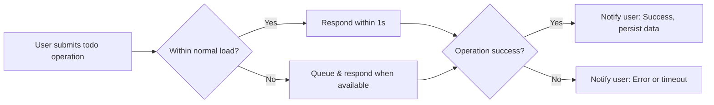

# Non-Functional Requirements for Todo List Application

## Performance Expectations

- WHEN a user creates, views, updates, or deletes a todo item, THE system SHALL respond within 1 second under normal load conditions.
- WHEN a user requests their todo list, THE system SHALL return all active todos within 1 second when up to 1,000 items exist in the user account.
- WHEN a batch operation (e.g., marking multiple todos complete) is performed for up to 100 items, THE system SHALL complete processing and acknowledge success or failure within 2 seconds.
- WHEN serving up to 1,000 concurrent authenticated users, THE system SHALL ensure that no more than 5% of requests exceed a 1 second response time.
- WHERE user activity exceeds normal operational capacity, THE application SHALL queue and process requests in a manner that is fair and maintains predictable behavior for all users.
- WHEN a user submits excessive requests (over 30 per minute), THE system SHALL enforce request throttling to ensure uninterrupted service and prevent abuse.
- WHEN the system cannot fulfill a request due to overload or internal failure, THE user SHALL receive a clear error or timeout message within 3 seconds, including guidance to retry.

## Reliability and Availability

- THE Todo list application SHALL maintain 24/7 availability, targeted at 99.5% or greater uptime, measured monthly.
- WHEN outages or interruptions occur, THE system SHALL display a clear notification to users at next login or operation and SHALL provide appropriate information regarding possible restoration.
- WHEN users create, update, or delete todos, THE system SHALL guarantee that no operation is lost in transit and SHALL provide atomicity for each modification event.
- WHEN a write operation completes, THE system SHALL confirm success or failure with a decisive response message, so the user always knows the outcome.
- IF a partial outage disables writing but not reading, THEN authenticated users SHALL retain access to read their data in a read-only mode until the outage is resolved.
- WHEN a user deletes their account, THE system SHALL securely retain all associated data for a minimum of 30 days to enable recovery or user inquiry, unless legal obligations require immediate purging.
- WHEN transaction failures or data conflicts occur, THE system SHALL preserve user input intent (e.g., entered todo data) and prompt the user with a retry option.

## Security, Privacy, and Compliance

- WHEN accessing any todo data, THE system SHALL require secure user authentication prior to allowing access.
- WHEN authenticated, THE user SHALL access ONLY their own todos; under no circumstances SHALL user todo data be visible to any other authenticated or unauthenticated party.
- WHERE a login takes place from a new device or location, THE system SHALL notify the user and record the event for security and audit purposes.
- WHEN transmitting data, THE system SHALL always use industry-standard encryption to protect sensitive information in transit.
- WHEN users register or reset their password, THE system SHALL enforce strong password rules: minimum 8 characters, at least 1 uppercase and 1 lowercase letter, and at least 1 symbol or digit.
- WHEN a password is changed or reset, THE system SHALL invalidate previous sessions except for the current device, to prevent unauthorized access.
- WHEN operating globally, THE system SHALL comply with relevant privacy and data protection regulations (e.g., GDPR or equivalent as required by the application's region of operation).
- WHEN a user requests account deletion, THE system SHALL anonymize or erase all associated todo data from active systems within 30 days of confirmation unless legal retention supersedes.
- WHEN todos or related user data are accessed or changed, THE system SHALL maintain an audit log for at least 60 days for security and troubleshooting; logs SHALL include only operationally relevant, non-sensitive information.

## Non-Functional Quality Flow

## Compliance and User Experience Notes

- WHEN displaying system notifications, THE user SHALL always receive clear, non-technical messages in their preferred language regarding system status, errors, and successes.
- WHEN processing or storing user data, THE Todo list application SHALL ensure transparency and compliance with all relevant privacy and data protection obligations. No data SHALL be disclosed beyond its intended user or required audit reporting.
- WHEN handling errors, THE application SHALL never reveal diagnostic or internal system information (such as stack traces or identifiers), instead providing only user-appropriate guidance and feedback.