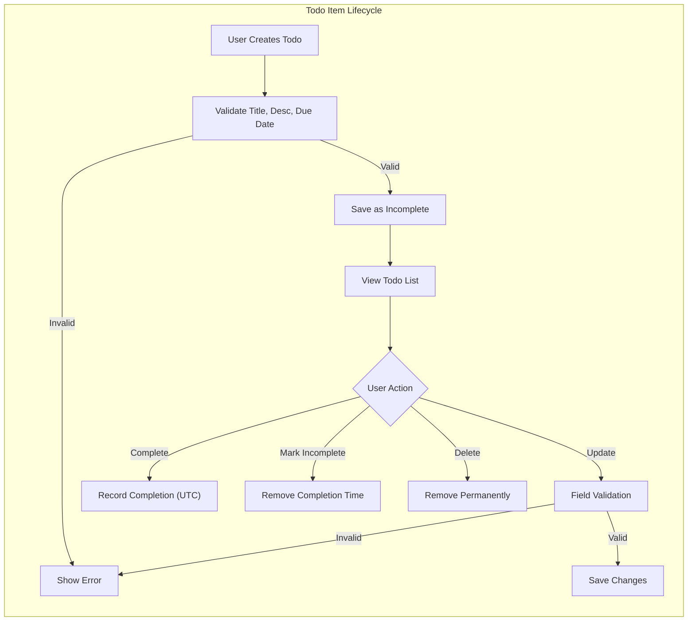

# Todo List Application – Business Requirements & Constraints

## Purpose and Scope
The Todo List application is designed to allow users to create, view, update, and delete personal todo items efficiently. Only minimal, essential functionality is specified in order to deliver a simple yet reliable experience tailored to basic todo management needs. All requirements are structured for backend development, written in actionable, measurable EARS-compliant natural language.

## User Roles and Authentication
- The only actor is the “user.” Each user SHALL be authenticated before accessing any todo-related functionality.
- WHEN a user’s authentication token is missing or expired, THE system SHALL deny all todo actions and require login.
- THE system SHALL enforce that every todo item is strictly associated with a single, unique authenticated user (the owner).
- THE system SHALL NOT allow any cross-user access; a user may only manage their own todos.

## Todo Item: Core Functional Requirements
### Creation
- WHEN a user creates a todo item, THE system SHALL require a non-empty title field (max 255 characters).
- WHEN a user provides a title exceeding 255 characters, THE system SHALL reject the request and inform the user of the maximum length constraint.
- WHEN a user provides a todo description, THE system SHALL accept up to 1000 characters, rejecting input and sending a clear error message if this is exceeded.
- WHEN a user adds a due date, THE system SHALL only accept ISO 8601 format values representing future dates or null (undated). Invalid date formats or past dates SHALL be rejected with a user-facing error message.
- WHEN a todo is created, THE system SHALL automatically set its status to “incomplete.”
- WHEN a user attempts to create a todo having both a title and due date identical to an existing, non-completed todo, THE system SHALL reject the creation as a duplicate and provide a relevant error message.

### Viewing and Retrieval
- WHEN a user views their todo list, THE system SHALL return only those todo items owned by the requesting user.
- THE system SHALL support listing with pagination: WHEN a user requests their todos, THE system SHALL return results in pages with a default size of 20 and SHALL allow configuration by developer policy up to a maximum of 100 per page.
- THE system SHALL support at least 500 active (non-completed and non-deleted) todos per user account without performance degradation.
- WHEN a user requests their first page of todos (maximum 20), THE system SHALL respond within 2 seconds if the account holds fewer than 500 active todos.

### Modification
- WHEN a user updates the title, description, or due date of a todo, THE system SHALL apply all creation rules for validation.
- WHEN a user marks a todo as complete, THE system SHALL record the current UTC datetime (ISO 8601) as the completion timestamp.
- WHEN a user marks a completed todo as incomplete, THE system SHALL remove the completion timestamp.
- ONLY the owner user SHALL be permitted to update their own todos; all attempts to modify any other user’s data SHALL be denied and return an authorization error.

### Deletion
- WHEN a user deletes a todo item, THE system SHALL irreversibly remove the item from all user-accessible lists.
- ONLY the owner user SHALL be permitted to delete their own todos at any time.

## Data Integrity and Security
- THE system SHALL enforce strict logical isolation between users, preventing any data leak or unauthorized access between accounts.
- THE system SHALL require authentication for all todo-related actions and reject any unauthenticated requests.
- THE system SHALL log all create, update, and delete actions for accountability and support troubleshooting.

## Feedback, Errors, and Validation
- WHEN any field validation fails (title, description, due date), THE system SHALL provide a clear, user-focused error message specifying the exact constraint violated.
- WHEN a forbidden action is attempted (modifying another user’s todo, unauthorized access), THE system SHALL return an authorization error without further detail about the target.
- WHEN an operation cannot be completed within 2 seconds, THE system SHALL provide a temporary unavailability message to the user.

## Audit and Operational Change Management
- THE system SHALL audit significant user todo actions to support troubleshooting and compliance obligations.
- THE system SHALL allow key operational parameters (title/description length, max todos, page size, etc.) to be configured by developers without data loss or integrity issues.

## Compliance with Minimalism and User-Centricity
- THE system SHALL always require the minimum necessary fields for todo item creation.
- Extended fields or optional metadata SHALL remain optional and unobtrusive to the user experience.

## Business Rule Visualization

## Summary Table: Key Business Rules (EARS Format)
| Rule | EARS Statement |
|------|---------------|
| Ownership | WHEN a user takes any todo item action, THE system SHALL ensure only the owner can alter or delete it. |
| Validation | WHEN a field fails a constraint, THE system SHALL provide a specific message indicating the error and required fix. |
| Completion | WHEN a todo is marked complete, THE system SHALL store the UTC timestamp as proof of completion. |
| Duplication | WHEN a new todo matches an existing title and due date, THE system SHALL reject it as a duplicate. |
| Isolation | WHEN a user views or manages todos, THE system SHALL return only their own. |
| Pagination | WHEN a user retrieves todos, THE system SHALL paginate results as specified. |
| Performance | WHEN retrieving or writing todos, THE system SHALL respond within 2 seconds for normal cases. |
| Error Feedback | WHEN any unauthorized or unavailable action is attempted, THE system SHALL provide a clear error message. |

## Conclusion
These requirements specify the minimum, production-grade business rules for a Todo List application focused on simplicity, user privacy, reliability, and integrity. All requirements are implementation-neutral, user-centric, and structured to provide unambiguous guidance to backend engineers for system implementation and downstream integration.