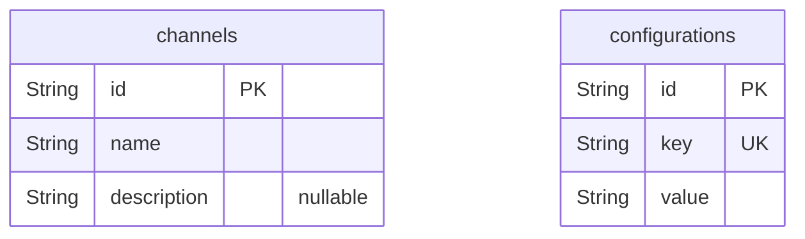
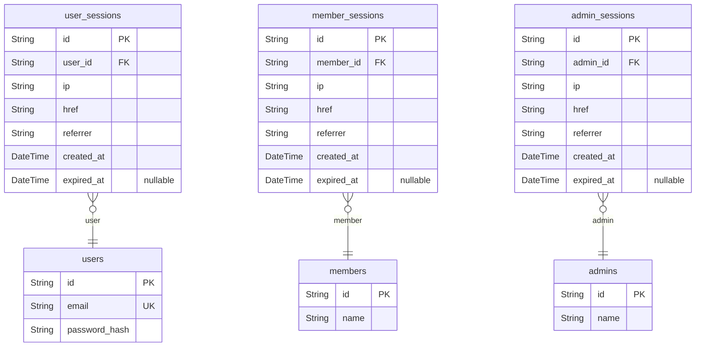
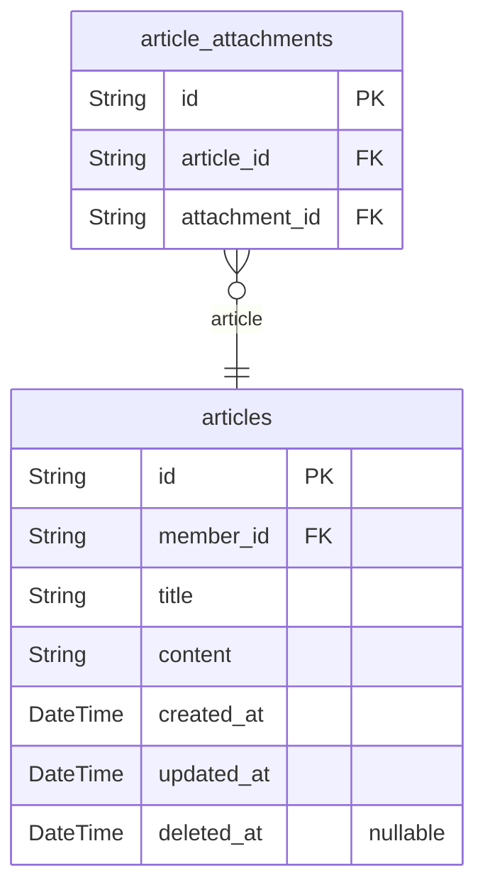
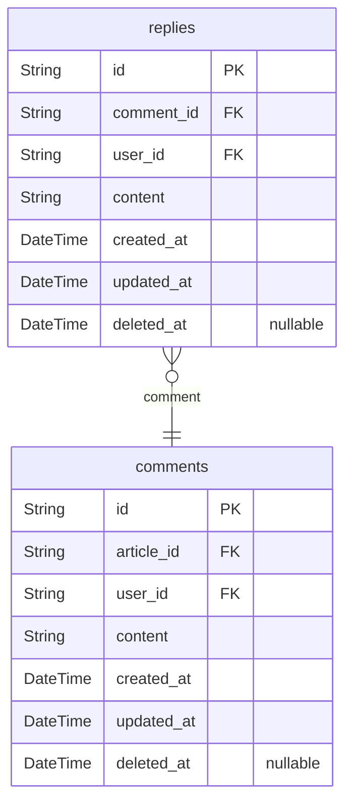
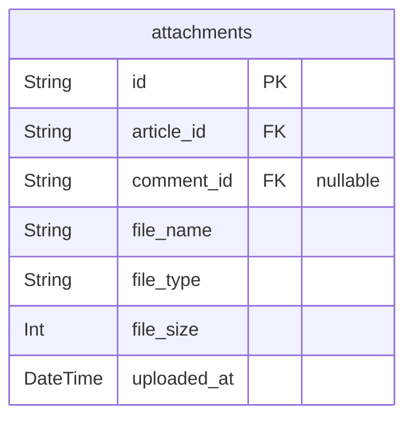
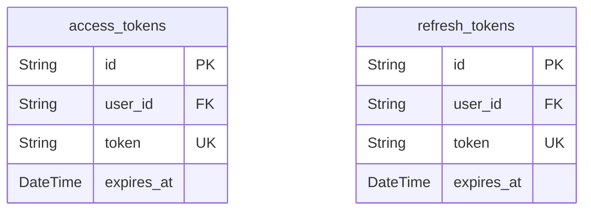
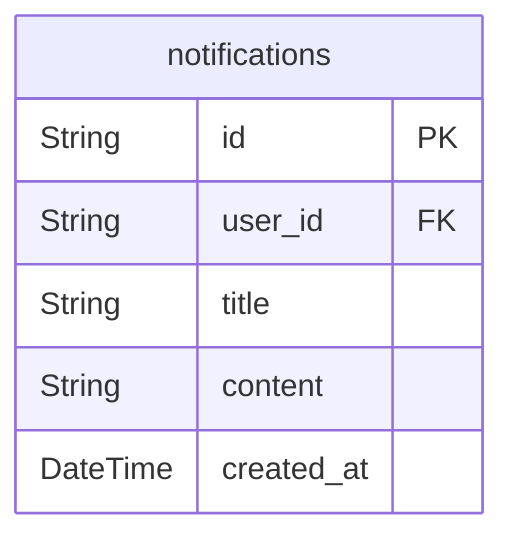
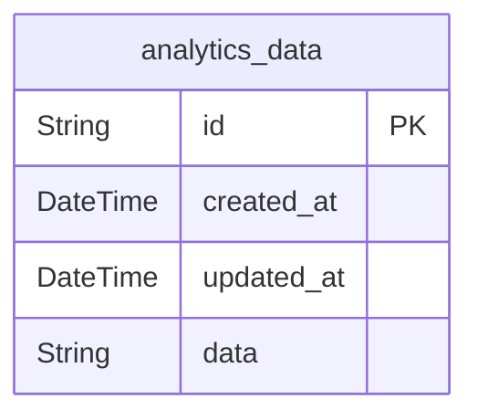
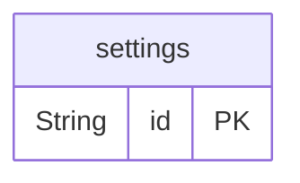

# Prisma Markdown

> Generated by [`prisma-markdown`](https://github.com/samchon/prisma-markdown)

- [Systematic](#systematic)
- [Actors](#actors)
- [Articles](#articles)
- [Comments](#comments)
- [Attachments](#attachments)
- [Security](#security)
- [Notifications](#notifications)
- [Analytics](#analytics)
- [Settings](#settings)

## Systematic

### `channels`

Represents a communication channel for the discussion board. Channels can
be used for different topics or categories of discussions.

Properties as follows:

- `id`: Primary Key.
- `name`: Name of the channel.
- `description`: Description of the channel.

### `configurations`

Stores configuration settings for the discussion board. This can include
site-wide settings, feature flags, and other configurable options.

Properties as follows:

- `id`: Primary Key.
- `key`: Configuration key.
- `value`: Configuration value.

## Actors

### `users`

User information, but not a person but a connection basis

Properties as follows:

- `id`: Primary Key.
- `email`: Email for notifications and login.
- `password_hash`: Password hash for secure authentication.

### `user_sessions`

User session information for authentication

Properties as follows:

- `id`: Primary Key.
- `user_id`: Foreign Key. [users.id](#users)
- `ip`: IP address of the user's device.
- `href`: URL of the user's session.
- `referrer`: Referrer URL of the user's session.
- `created_at`: Timestamp when the session was created.
- `expired_at`: Timestamp when the session expires.

### `members`

Member-specific information

Properties as follows:

- `id`: Primary Key.
- `name`: Member name.

### `member_sessions`

Member session information

Properties as follows:

- `id`: Primary Key.
- `member_id`: Foreign Key. [members.id](#members)
- `ip`: IP address of the member's device.
- `href`: URL of the member's session.
- `referrer`: Referrer URL of the member's session.
- `created_at`: Timestamp when the session was created.
- `expired_at`: Timestamp when the session expires.

### `admins`

Admin-specific information

Properties as follows:

- `id`: Primary Key.
- `name`: Admin name.

### `admin_sessions`

Admin session information

Properties as follows:

- `id`: Primary Key.
- `admin_id`: Foreign Key. [admins.id](#admins)
- `ip`: IP address of the admin's device.
- `href`: URL of the admin's session.
- `referrer`: Referrer URL of the admin's session.
- `created_at`: Timestamp when the session was created.
- `expired_at`: Timestamp when the session expires.

## Articles

### `articles`

Main entity for articles on the discussion board. Each article can have
multiple attachments.

Properties as follows:

- `id`: Primary Key.
- `member_id`: Belongs to member. [members.id](#members)
- `title`: Article title.
- `content`: Article content.
- `created_at`: Timestamp when the article was created.
- `updated_at`: Timestamp when the article was last updated.
- `deleted_at`: Timestamp when the article was soft-deleted.

### `article_attachments`

Junction table for article attachments. Establishes many-to-many
relationships between articles and attachments.

Properties as follows:

- `id`: Primary Key.
- `article_id`: Belongs to article. [articles.id](#articles)
- `attachment_id`: Belongs to attachment. [attachments.id](#attachments)

## Comments

### `comments`

Main entity for threaded comments on articles.

Properties as follows:

- `id`: Primary Key.
- `article_id`: FK to articles.id.
- `user_id`: FK to users.id.
- `content`: Comment text content.
- `created_at`: Comment creation timestamp.
- `updated_at`: Comment last update timestamp.
- `deleted_at`: Soft delete timestamp (nullable).

### `replies`

Subentity for threaded replies to comments.

Properties as follows:

- `id`: Primary Key.
- `comment_id`: FK to comments.id.
- `user_id`: FK to users.id.
- `content`: Reply text content.
- `created_at`: Reply creation timestamp.
- `updated_at`: Reply last update timestamp.
- `deleted_at`: Soft delete timestamp (nullable).

## Attachments

### `attachments`

Stores information about file attachments for articles and comments.

Properties as follows:

- `id`: Primary Key.
- `article_id`: Foreign key referencing the articles table.
- `comment_id`: Foreign key referencing the comments table.
- `file_name`: Name of the attached file.
- `file_type`: Type of the attached file (e.g., image/jpeg, application/pdf).
- `file_size`: Size of the attached file in bytes.
- `uploaded_at`: Timestamp when the file was uploaded.

## Security

### `access_tokens`

Access tokens for authenticated users.

Properties as follows:

- `id`: Primary Key.
- `user_id`: FK to users.id
- `token`: Access token value.
- `expires_at`: Token expiration time.

### `refresh_tokens`

Refresh tokens for authenticated users.

Properties as follows:

- `id`: Primary Key.
- `user_id`: FK to users.id
- `token`: Refresh token value.
- `expires_at`: Token expiration time.

## Notifications

### `notifications`

Manages alerts for users.

Properties as follows:

- `id`: Primary Key.
- `user_id`: Belonged user's [users.id](#users)
- `title`: Notification title.
- `content`: Notification content.
- `created_at`: Timestamp when the notification was created.

## Analytics

### `analytics_data`

Stores usage and engagement metrics for analytics purposes.

Properties as follows:

- `id`: Primary Key.
- `created_at`: Timestamp when the analytics data was recorded.
- `updated_at`: Timestamp when the analytics data was last updated.
- `data`: Serialized data containing usage and engagement metrics.

## Settings

### `settings`

Stores platform-wide settings. Customizable by admins. Centralizes
configuration.

Properties as follows:

- `id`: Primary Key.
