# Prisma Markdown

> Generated by [`prisma-markdown`](https://github.com/samchon/prisma-markdown)

- [Systematic](#systematic)
- [Actors](#actors)
- [Community](#community)
- [Posts](#posts)
- [Karma](#karma)
- [Votes](#votes)
- [Subscriptions](#subscriptions)
- [Reports](#reports)
- [Search](#search)
- [Analytics](#analytics)
- [Settings](#settings)

## Systematic

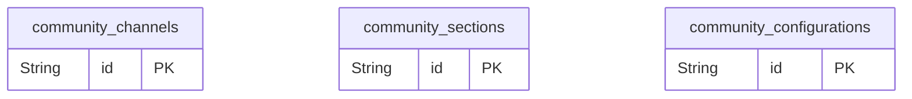

### `community_channels`

Community channels table

Properties as follows:

- `id`: Primary Key.

### `community_sections`

Community sections table

Properties as follows:

- `id`: Primary Key.

### `community_configurations`

Community configurations table

Properties as follows:

- `id`: Primary Key.

## Actors

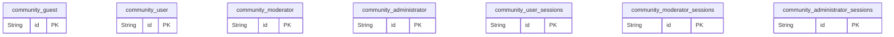

### `community_guest`

Guest user model

Properties as follows:

- `id`: Primary Key.

### `community_user`

User model with added fields

Properties as follows:

- `id`: Primary Key.

### `community_moderator`

Moderator model

Properties as follows:

- `id`: Primary Key.

### `community_administrator`

Administrator model

Properties as follows:

- `id`: Primary Key.

### `community_user_sessions`

User session model

Properties as follows:

- `id`: Primary Key.

### `community_moderator_sessions`

Moderator session model

Properties as follows:

- `id`: Primary Key.

### `community_administrator_sessions`

Administrator session model

Properties as follows:

- `id`: Primary Key.

## Community

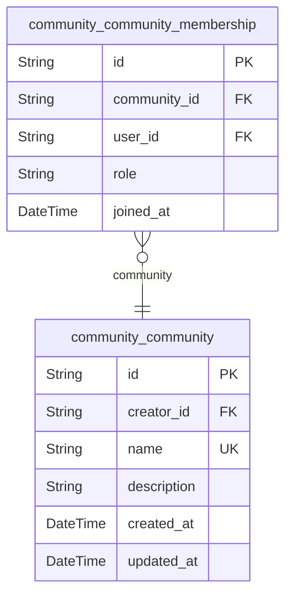

### `community_community`

Community information, including name, description, and creator details.

Properties as follows:

- `id`: Primary Key.
- `creator_id`: Belongs to creator. [community_user.id](#community_user)
- `name`: Community name.
- `description`: Community description.
- `created_at`: Timestamp when community was created.
- `updated_at`: Timestamp when community was last updated.

### `community_community_membership`

Membership information for communities, linking users to communities.

Properties as follows:

- `id`: Primary Key.
- `community_id`: Belongs to community. [community_community.id](#community_community)
- `user_id`: Belongs to user. [community_user.id](#community_user)
- `role`: User role in community (e.g., member, moderator, admin).
- `joined_at`: Timestamp when user joined community.

## Posts

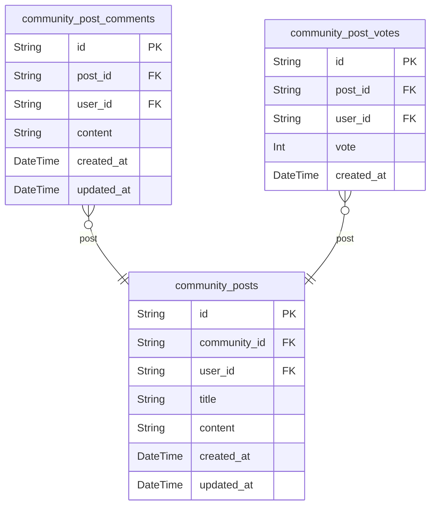

### `community_posts`

Main entity for posts in communities.

Properties as follows:

- `id`: Primary Key.
- `community_id`: FK to community_community.id
- `user_id`: FK to community_user.id
- `title`: Post title.
- `content`: Post content.
- `created_at`: Post creation timestamp.
- `updated_at`: Post update timestamp.

### `community_post_comments`

Comments on posts.

Properties as follows:

- `id`: Primary Key.
- `post_id`: FK to community_posts.id
- `user_id`: FK to community_user.id
- `content`: Comment content.
- `created_at`: Comment creation timestamp.
- `updated_at`: Comment update timestamp.

### `community_post_votes`

Votes on posts.

Properties as follows:

- `id`: Primary Key.
- `post_id`: FK to community_posts.id
- `user_id`: FK to community_user.id
- `vote`: Vote value (1 or -1).
- `created_at`: Vote timestamp.

## Karma

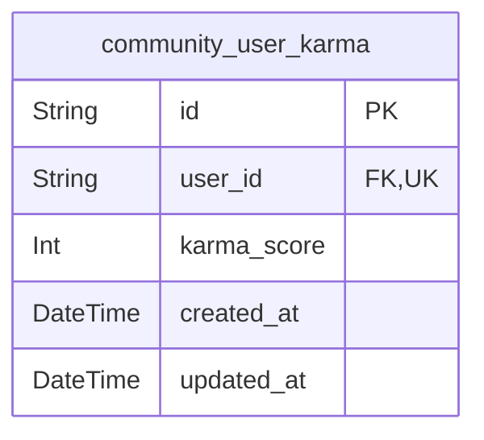

### `community_user_karma`

User karma tracking entity.

Properties as follows:

- `id`: Primary Key.
- `user_id`: Target description. [community_user.id](#community_user).
- `karma_score`: Current karma score.
- `created_at`: Karma tracking start time.
- `updated_at`: Last karma update time.

## Votes

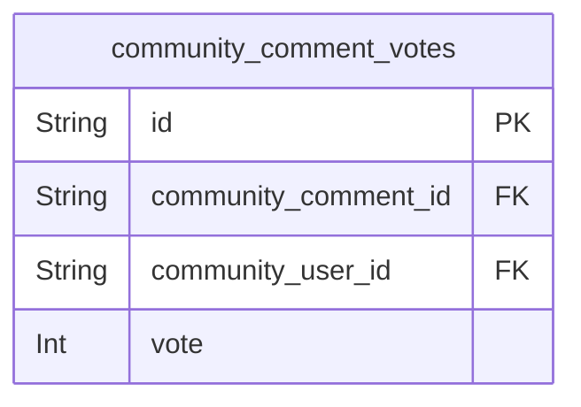

### `community_comment_votes`

Votes for community comments.

Properties as follows:

- `id`: Primary Key.
- `community_comment_id`: FK to community_post_comments.id.
- `community_user_id`: FK to community_user.id.
- `vote`: Upvote (1) or downvote (-1).

## Subscriptions

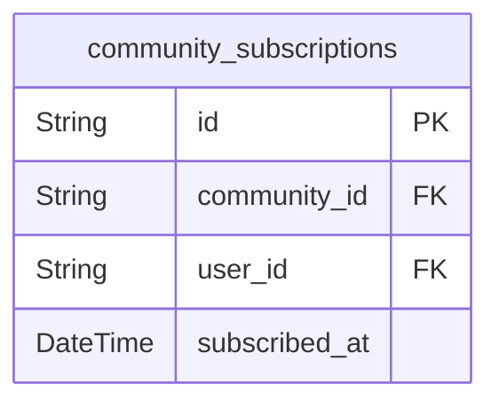

### `community_subscriptions`

User subscriptions to communities for personalized notifications.

Properties as follows:

- `id`: Primary Key.
- `community_id`: Target community. [community_community.id](#community_community)
- `user_id`: Subscribed user. [community_user.id](#community_user)
- `subscribed_at`: Subscription creation timestamp.

## Reports

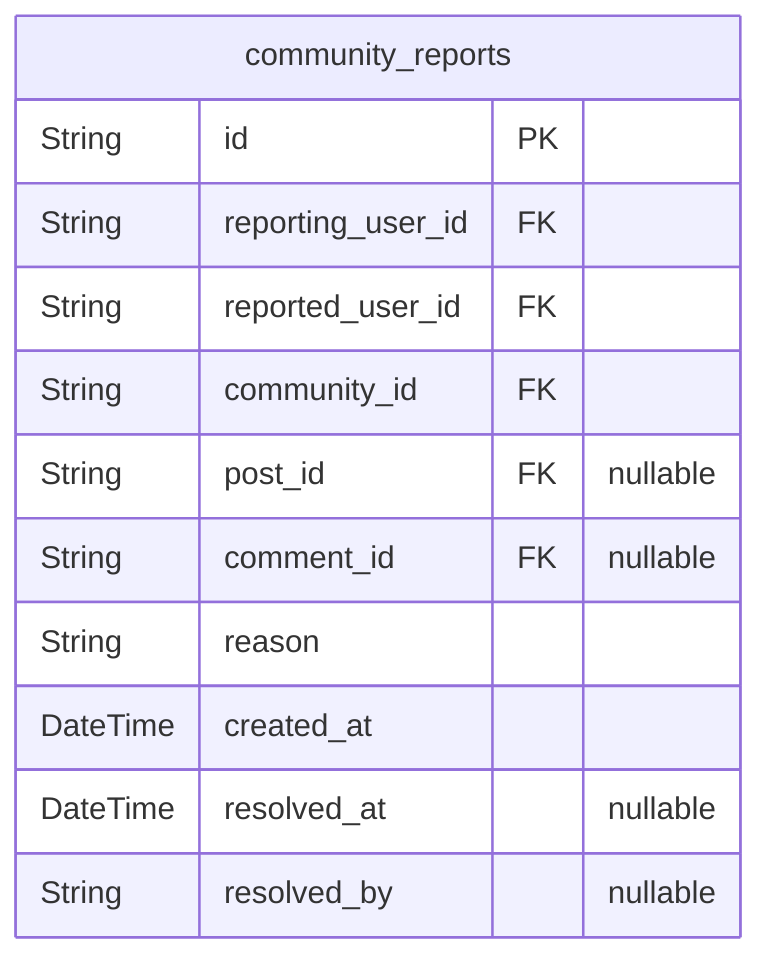

### `community_reports`

User reports for moderation.

Properties as follows:

- `id`: Primary Key.
- `reporting_user_id`: Reporting user. [community_user.id](#community_user)
- `reported_user_id`: Reported user. [community_user.id](#community_user)
- `community_id`: Community. [community_community.id](#community_community)
- `post_id`: Post. [community_posts.id](#community_posts)
- `comment_id`: Comment. [community_post_comments.id](#community_post_comments)
- `reason`: Reason for report.
- `created_at`: Timestamp when report was created.
- `resolved_at`: Timestamp when report was resolved.
- `resolved_by`: Moderator who resolved the report. [community_moderators.id](#community_moderators)

## Search

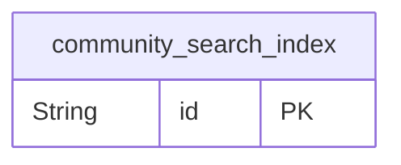

### `community_search_index`

Search index for community posts and comments.

Properties as follows:

- `id`: Primary Key.

## Analytics

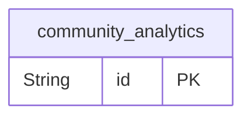

### `community_analytics`

Analytics data for community platform usage and performance

Properties as follows:

- `id`: Primary Key.

## Settings

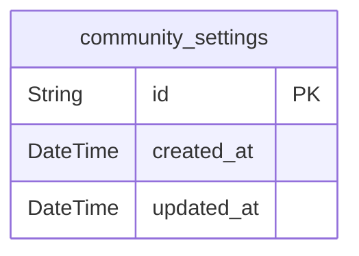

### `community_settings`

Community settings for customization and configuration.

Properties as follows:

- `id`: Primary Key.
- `created_at`: Timestamp for when the setting was created.
- `updated_at`: Timestamp for when the setting was last updated.
