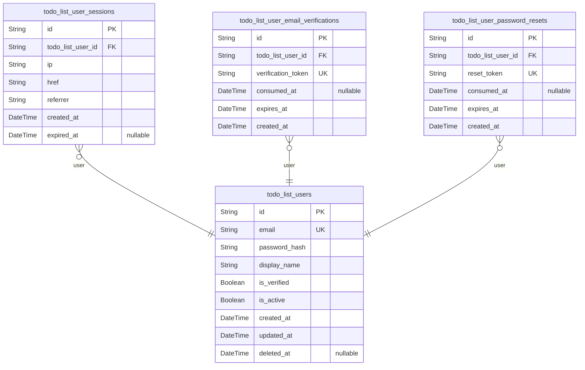
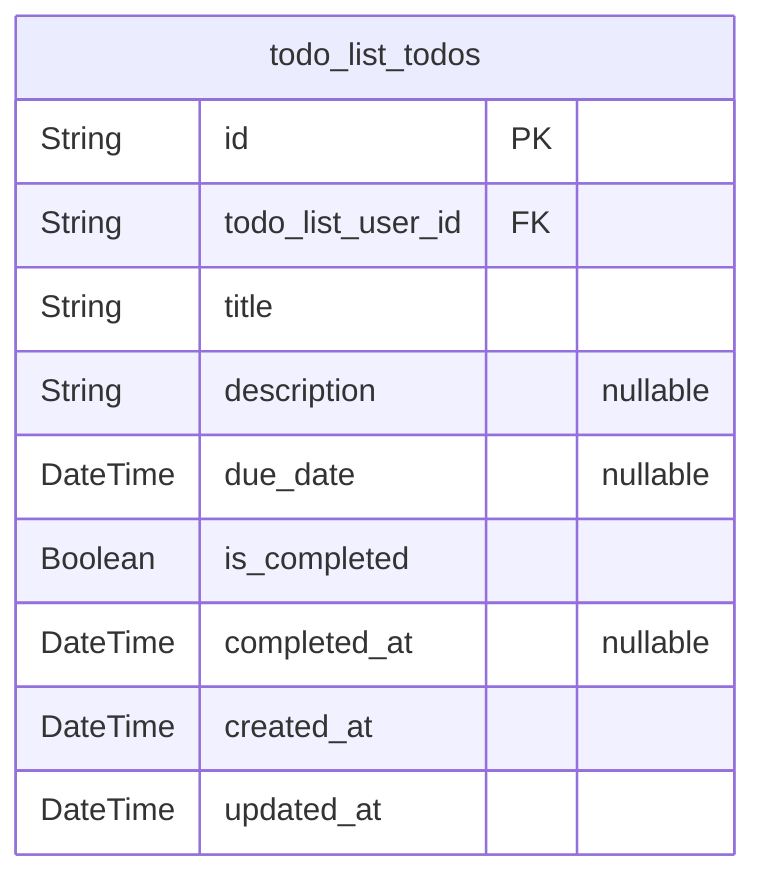

# Prisma Markdown

> Generated by [`prisma-markdown`](https://github.com/samchon/prisma-markdown)

- [Actors](#actors)
- [Todos](#todos)

## Actors

### `todo_list_users`

Core registered user entity for the Todo List application.

Stores authentication, identity, and business profile data for each
unique account. Includes required credential fields (email, password
hash), display name, verification and activation statuses, and timestamps
for audit trail and lifecycle management. Serves as the root entity for
all user and authentication operations. Every todo belongs to a single
user, but todos are managed in separate component tables. Unique email
address is strictly enforced, and passwords are stored only as
cryptographic hashes.

Deletion means account is permanently erased, with all data removed, and
account cannot be recovered.

Properties as follows:

- `id`: Primary Key.
- `email`
  > Unique email address for user account login. Used as the user's global
  > identifier. Cannot be changed after registration. Must be unique,
  > lowercase, and properly formatted (RFC 5322).
- `password_hash`
  > Salted cryptographically-secure hash of the user's password, never the
  > plain password. Used only for authentication.
- `display_name`
  > Display name for the user, shown in their own UI context. Modifiable by
  > user but unique globally is not enforced.
- `is_verified`
  > Indicates whether the user's email has been successfully verified. Set to
  > true only after email check and activation link consumed.
- `is_active`
  > Indicates if the user account is enabled and usable for logins and
  > business operations. Set to false on permanent or temporary deactivation
  > (e.g., after deletion or security hold).
- `created_at`
  > Account creation timestamp, stored in UTC (ISO 8601). Set only at
  > registration.
- `updated_at`: Timestamp of last account update (any profile or credential change).
- `deleted_at`
  > Indicates timestamp of permanent account removal. Null if the account is
  > active.

### `todo_list_user_sessions`

Authentication session audit log and context for each user login session.

Tracks every sign-in and session renewal for a user across web/mobile
channels, supporting multiple concurrent sessions. Relates to the user as
a foreign key. Provides connection metadata (IP, href, referrer), and
enables session-level expiry and control. Sessions are necessary for JWT
or token life-cycle tracking, session revocation, and security
investigations. No soft deletion—expired sessions remain for audit and
traceability.

Indexed by (user_id, created_at) for efficient per-user auditing and
security monitoring.

Properties as follows:

- `id`: Primary Key.
- `todo_list_user_id`
  > Foreign key to [todo_list_users.id](#todo_list_users). The account associated with
  > this session.
- `ip`
  > IP address of session origin (IPv4 or IPv6, as string). Used for risk
  > analysis and audit trails.
- `href`
  > Original URL requested at session start/login (may be used for security
  > or analytics).
- `referrer`
  > HTTP referrer header value at session start (may be used for tracing
  > session origin).
- `created_at`: UTC-timestamp of session creation (login time).
- `expired_at`
  > UTC-timestamp when session/token is marked as expired/invalid. Null if
  > still valid.

### `todo_list_user_email_verifications`

Verification events for user account email activation and continued trust.

Records every verification token/email issued and its redemption/expiry
process for user email identity. Ensures every authentication email link
usage is tracked, enabling repeat verifications, security event tracing,
and usage auditing. Contains immutable issued token information,
creation/expiration, and redemption metadata. Only tied to users in this
component, and all verification lifecycles are distinct rows for security
traceability. Used for compliance and prevention of replay attacks.

Properties as follows:

- `id`: Primary Key.
- `todo_list_user_id`
  > Foreign key to [todo_list_users.id](#todo_list_users). The user account awaiting
  > email verification.
- `verification_token`
  > Secure single-use, randomly-generated string issued for email
  > verification. Must be unique. Set at creation.
- `consumed_at`
  > Indicates timestamp the verification was successfully consumed (i.e.,
  > user activated link). Null if unused or expired.
- `expires_at`
  > Timestamp when the verification offer is no longer valid. Set at
  > creation, immutable.
- `created_at`: UTC timestamp of event creation (when token/email was issued).

### `todo_list_user_password_resets`

Audit log and flow context for password reset requests by users.

Tracks every time a user requests and uses a password reset event,
enforcing security best practices (single-use, token expiry, invalidation
after use). Enables rate limiting, detects replay or brute force
attempts, and preserves an immutable audit trail for account recovery
flows.

Tokens are unique, time-limited, and have a one-to-one correspondence
with an individual password reset request. Related only to this domain's
users. Includes timestamps for creation, expiry, and redemption, with
full traceability for compliance, user support, and investigation.

Properties as follows:

- `id`: Primary Key.
- `todo_list_user_id`
  > Foreign key to [todo_list_users.id](#todo_list_users). The owner of the password
  > reset process.
- `reset_token`
  > Secure, cryptographically random, single-use token for password reset.
  > Unique per event. Used in password reset link delivery.
- `consumed_at`
  > Timestamp when this password reset token was used (password successfully
  > reset). Null if unused/expired.
- `expires_at`: Timestamp when the reset token/link becomes invalid and may not be used.
- `created_at`: Timestamp when the reset request was initiated.

## Todos

### `todo_list_todos`

Table of actionable todo items for users.

This primary business entity stores each individual task a user creates
in the minimalist todo application. Every todo is strictly owned by a
single user, enforced by a foreign key reference to the user table
([todo_list_users.id](#todo_list_users)).

The table includes all validated business fields: a required, trimmed
title; an optional extended description; an optional due date; and
completion workflow tracked by 'is_completed' and 'completed_at'.

Temporal columns provide complete auditability for all list operations:
creation, update, and completion are timestamped to ISO 8601 UTC. Each
row may be accessed and managed only by its owning user, with all access
control and CRUD operations enforced at the application/service layer and
indexed for query performance.

This table admits no sharing or collaborative features and holds no
denormalized or calculated fields. All business logic for todo
management, completion toggling, and list UI operations is satisfied via
this model and its comprehensive field set. The design guarantees strict
data privacy, 3NF normalization, and production-grade scalability in a
single-user context.

Properties as follows:

- `id`
  > Primary Key. Unique identifier for each todo item, generated as UUID at
  > creation.
- `todo_list_user_id`
  > Owning user who created and may access this todo. {@link
  > todo_list_users.id}.
- `title`
  > Short, required title for the todo item (1–100 characters, trimmed). Must
  > be non-empty and unique only within the business context of the user.
- `description`
  > Optional extended detail for the todo. Maximum 1000 characters; null or
  > empty permitted.
- `due_date`
  > Optional due date for the todo in ISO 8601 UTC format. Must be present or
  > future if set; null is allowed for floating tasks.
- `is_completed`
  > Completion status of the todo. True if the item is finished, false for
  > pending tasks. Can only be changed by the owner.
- `completed_at`
  > Timestamp when the todo was completed. System-managed; set to UTC now
  > when is_completed becomes true, cleared when reverted to incomplete. Null
  > if never completed.
- `created_at`
  > System-managed timestamp for todo creation (ISO 8601 UTC). Readonly to
  > users.
- `updated_at`
  > System-managed timestamp for last modification. Always updated on any
  > change (ISO 8601 UTC). Readonly to users.
