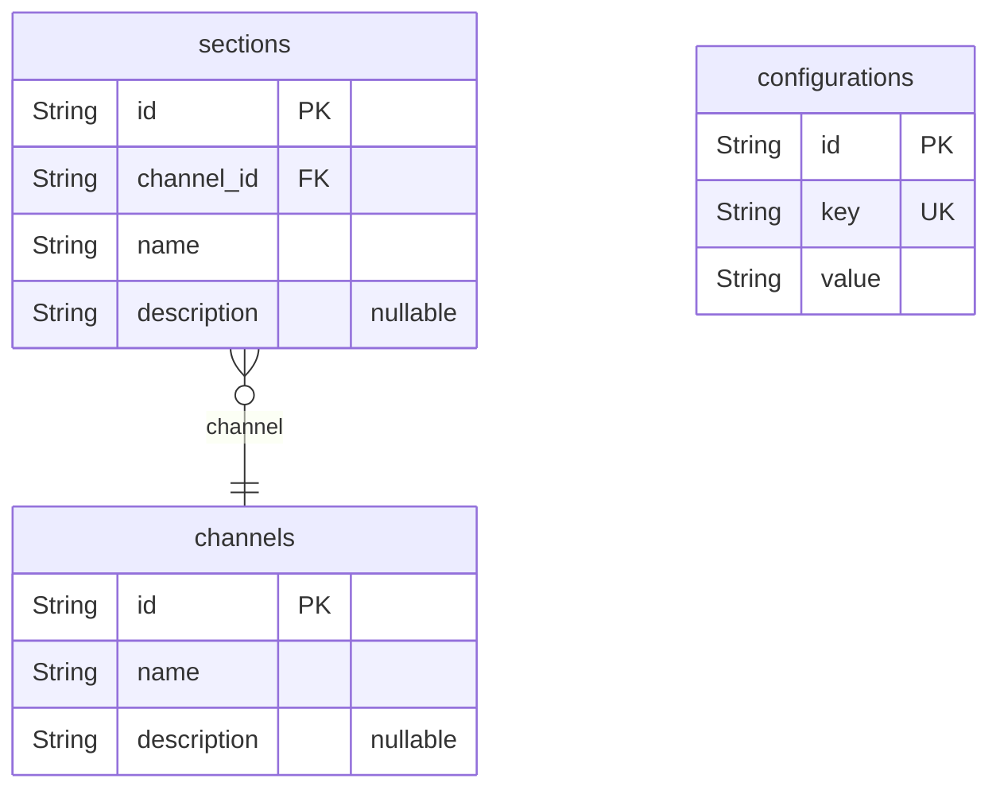
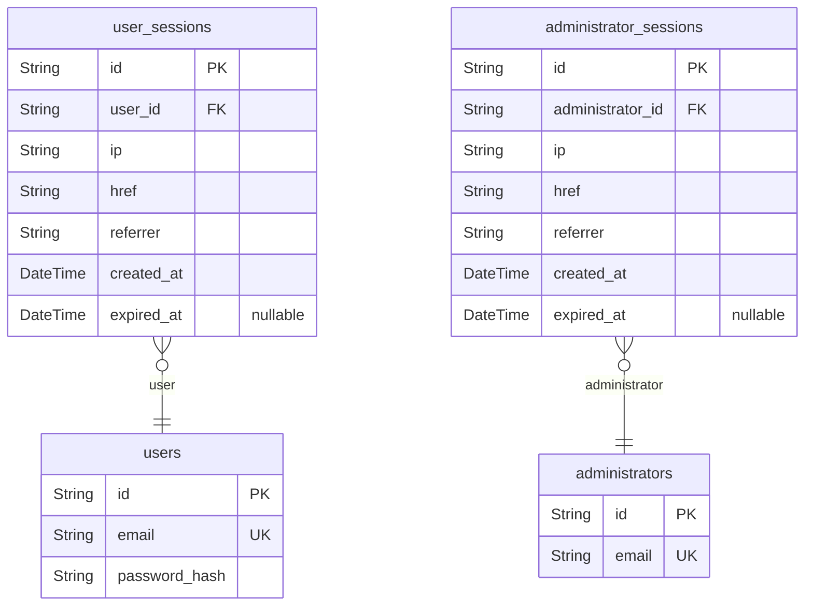

# Prisma Markdown

> Generated by [`prisma-markdown`](https://github.com/samchon/prisma-markdown)

- [Systematic](#systematic)
- [Actors](#actors)

## Systematic

### `channels`

Represents a communication channel in the system.

Properties as follows:

- `id`: Primary Key.
- `name`: Name of the channel.
- `description`: Description of the channel.

### `sections`

Represents a section within a channel.

Properties as follows:

- `id`: Primary Key.
- `channel_id`: Foreign key referencing the Channels table.
- `name`: Name of the section.
- `description`: Description of the section.

### `configurations`

Represents system configurations.

Properties as follows:

- `id`: Primary Key.
- `key`: Configuration key.
- `value`: Configuration value.

## Actors

### `users`

User accounts for authentication and authorization

Properties as follows:

- `id`: Primary Key.
- `email`: User's email address for login and notifications.
- `password_hash`: Hashed password for secure authentication.

### `user_sessions`

Session data for authenticated users

Properties as follows:

- `id`: Primary Key.
- `user_id`: References the Users table.
- `ip`: User's IP address.
- `href`: Session URL.
- `referrer`: Referrer URL.
- `created_at`: Session creation time.
- `expired_at`: Session expiration time.

### `administrators`

Administrator accounts for system management

Properties as follows:

- `id`: Primary Key.
- `email`: Administrator's email for login and notifications.

### `administrator_sessions`

Session data for administrators

Properties as follows:

- `id`: Primary Key.
- `administrator_id`: References the Administrators table.
- `ip`: Administrator's IP address.
- `href`: Session URL.
- `referrer`: Referrer URL.
- `created_at`: Session creation time.
- `expired_at`: Session expiration time.
